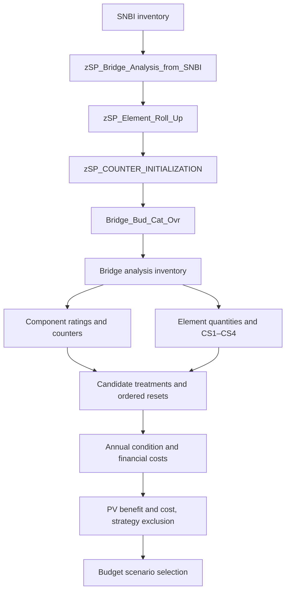

# How the configured BMS analysis works

This expands the 2026-09-24 audit into the bridge data path, both deterioration models, all sixteen treatment definitions, financial logic, strategy screening, and budget selection. Configuration was captured from the test service through Windows host **T20DOHB05L09456 / 192.168.1.63**. The follow-up read twelve existing strategies and six matching inventory rows; it did not run an analysis or modify the service.

The central distinction is that **component ratings and element condition states are separate models**. Component ratings drive overall structure condition and the principal benefit measure. Element condition percentages drive several maintenance triggers and costs. A treatment can change either model, freeze a component counter, reset an element counter, or do several of these in a specific order.

## Evidence map

| Document / SQLite data | Purpose |
| --- | --- |
| [Review findings](bms-findings.md) | Eleven concrete formula/binding findings with source links; also in `audit_bms_findings` |
| [Configuration register](bms-configuration-register.md) | Both analysis sets; all variable bindings, treatment sequences, scenario inputs, lookup coefficients, and unresolved references |
| [Treatment catalog](bms-treatments.md) | Exact triggers, all 554 ordered BMS resets, financial expressions, subsequent treatments, and ancillaries |
| [Budget allocations](bms-budgets.md) | 598 category/scenario rows; all 29,900 annual cells retained in `audit_bms_budget_years` |
| [Output examples](bms-output-examples.md) | Twelve strategies, six matched bridges, and eighteen treatment-event rows |
| [Numerical checks](bms-numerical-checks.md) | Formula replay, element conservation/bounds, and explicit sentinel edge cases |
| [Runtime references](runtime-and-scripting.md) | Preparation procedures, batch ordering, workflow definitions, and SQL-source access limit |
| [SQLite database](pms_bms_live.sqlite) | Original configuration, raw responses, joins, and diagnostic results |

## 1. Data preparation and identity

The current `Bridge_Analysis_Prep` batch orders:



The procedure registrations and observed execution records are available, but their SQL bodies were not recoverable: the source-text read action returned HTTP 403. Therefore the exact SNBI field mapping, roll-up implementation, and counter-fitting algorithm remain unknown. Procedure names alone do not prove those internals.

The final budget-category transformation assigns `Bridge_NON_NHS` when the referenced NHS field equals `'0'`; otherwise it assigns `Bridge_NHS`. This exact equality should not be silently replaced with the prefix checks used by some treatment expressions.

**A critical join:** output `ForeignKey` matches **`Bridge.ID`**, not `Bridge.ElementID`. The latter is the API entity key. All six sampled bridges matched ID after ElementID searches returned nothing. Both identifiers are retained in the raw records. A failed ElementID lookup does not establish that the source bridge was deleted.

Inventory inputs include component ratings stored as text, material/protection codes, ADT, deck area, ages, treatment-history counts, four component counter initializers, and each modeled element's total quantity and condition-state quantities. The preparation procedure supplies inputs that are then consumed by expression-based analysis initialization.

## 2. The two analysis sets and their horizon

`Bridge` and `Bridge_TP_Only` both currently specify start year **2027**, end year **2050**, treatment-application end **2045**, performance-plot end **2045**, discount rate **4**, and inflation rate **2**. They write to `ZBRIDGE_STRATS` and `ZBRGTPSTRATS`, with `_Y`, `_T`, and `_B` companion tables.

Both sets attach 98 performance variables. Their authored ordering places traffic first; Markov keys and modifiers next; life counters before deterioration counters; then component ratings, ages, treatment counts, composite measures, element counters/states, overall condition, costs, GFP, present values, and the exclusion variable. This is captured binding order, not proof of every internal engine scheduling step.

The function catalog explicitly defines **`YR` as the sequential analysis year**, with 1 being the first year. Committed-year comparisons and inflation exponents use this sequence. Do not substitute calendar year 2027 directly into a `COM_YEAR=YR` comparison without examining how preparation populated COM_YEAR.

There are two unresolved selection dependencies:

- `Bridge.FilterID` names `str_abfOBJ_Analysis`, but UUID `130a2ee6-3c36-4a80-b217-f7f3ac1a3f59` was absent from both expression endpoints, including targeted follow-up reads.
- `Bridge_TP_Only` uses `str_abfOBJ_Turnpike`, whose expression checks an unresolved field UUID's first three characters for `'S03'`. The field was also absent from a direct attribute probe. Its real identity is not asserted from the filter name.

Both sets expose generic category boundaries 0/60/80/90 alongside a structure-condition variable that uses component-rating values. Those configured boundaries are distinct from the explicit bridge GFP expression; their UI/reporting interpretation needs verification.

## 3. Component ratings: initialization, trajectories, and holds

### Initial state

For a culvert (`CULV_RATE <> 'N'`), the culvert rating initializes from `VAL(CULV_RATE)` and deck/superstructure/substructure initialize to -1. For nonculverts, each applicable component initializes from its text rating; `'N'` produces -1. This is an applicability sentinel, not a condition score of zero.

Each component also has:

- A **Markov key**, initially the inventory rating as text, with `'1'` substituted for an `'N'` rating.
- A **deterioration counter**, initialized from `COUNTER_INIT_DECK`, `COUNTER_INIT_SUPER`, `COUNTER_INIT_SUB`, or `COUNTER_INIT_CULVERT`, subject to the component's sentinel gates.
- A **life/hold counter**, initialized to zero.

The key selects a trajectory family and starting rating; the counter selects a position within that trajectory. Calendar age, component deterioration counter, and life/hold counter are different variables.

### Annual update

The standard counter formula holds its value if life is positive or the counter is negative; otherwise it increments by one, capped at **50**. The life formula subtracts one when positive, otherwise returns zero. Because life is listed before the counter, the difference between reading the old and newly decremented life value matters at the last hold year. The audit does not replace that scheduling question with an assumed number of frozen calendar years.

The component formula reads a `YR00`–`YR50` column from `Bridge_Lookup_CR_Life`. The column is built from the counter; the key is built as follows:

| Component | Family prefix |
| --- | --- |
| Deck | `DCK_P_` if the first protection-code character is not `'0'`; otherwise `DCK_` |
| Superstructure | `SUP_S_` for material beginning S; `SUP_P_` for C03/C04/C05; `SUP_T_` for T; otherwise `SUP_R_` |
| Substructure | `SUB_` |
| Culvert | `CUL_S_` for material beginning S; otherwise `CUL_C_` |

The current Markov text is appended to the prefix. There are nine families × nine starting-rating keys, giving **81 complete trajectories**, plus six numeric-key coefficient/template rows. All 81 trajectory rows passed completeness, range, and non-increasing checks. Their tabulated values can stay unchanged for several counter increments before stepping down. They are not annual linear decrements.

For example, `DCK_6` has values 6 at counters 0, 5, and 10; 5 at counter 20; and 2 at counter 50. `DCK_P_6` remains at 4 at counter 50. These examples compare stored lookup entries, not bridges with identical actual ages or histories.

**The deck, superstructure, and substructure deterioration modifiers currently return 1.** Their previous route/district lookup logic is commented out. The presence of `Bridge_Lookup_Det_Mod_Factors` does not mean that table actively changes these formulas. Similarly, component trajectory selection is separate from the element transition model below.

All captured bridge analysis variables have curve shifting disabled. Component treatment effects are represented through rating resets, new Markov keys, counters, and holds rather than the shifted raw-measure curves found in PMS.


[Vector version](bms-deterioration.svg). Left: stored rating-8 trajectories. Right: synthetic element evolution from 100% CS1, with counter starting at zero and no treatments.

## 4. Element condition states

The ten modeled element codes are **1080, 1130, 300–306, and 515**. The treatment formulas use 1080 for deck patching, 1130 for repeated sealing, 300–306 for joints, and 515 for painting. These are the configured relationships, without imposing a different external element-code taxonomy.

For an element with total quantity Q>0, each initial state is:

```text
CSi_initial = 100 × inventory quantity in state i / Q
```

An absent element initializes to zero in all four states. For present elements, the values are **percentages**, not quantities or 0–9 component ratings. An inventory with state quantities that do not sum to Q will not be normalized to 100 by these individual expressions.

Using prior-year states x1…x4, the current counter a, and lookup coefficients p11, p22, p23, p33, p34, F, the configured recurrence is:

```text
y1 = x1 × (p11 − min(F × a / 100, 1))
y2 = x2 × p22 + x1 − current CS1
y3 = x3 × p33 + x2 × p23
y4 = x4 + x3 × p34
```

The counter advances toward a maximum of 50. The CS2 expression explicitly reads **current CS1**, while the other incoming terms use `GET_ANALVAR_4_YR(...,YR−1)`. A simultaneous update that uses old CS1 in that subtraction is not equivalent.

For the captured coefficients, p11=1, p22+p23=1, and p33+p34=1. With CS1 evaluated first, the recurrence conserves the input total. The audit tested all ten elements, counters 0–50, and four basis distributions: **2,040 conservation checks and 2,040 bounds checks passed**. This goes beyond checking that the forty base lookup rows sum to one. It still does not prove ordering across multiple attached treatment resets.

Full replacement resets commonly set CS1=100 when Q>0 and the other states to zero. Spot painting moves CS3 into CS1 and CS4 into CS2 before zeroing CS3/CS4. These effects can improve maintenance eligibility measures without directly increasing a component rating.

## 5. Structure condition, GFP, CCR, and benefit weighting

There are three different condition outputs:

1. **Structure condition:** culvert rating for culverts; otherwise an explicit branch tree that usually selects the minimum applicable component rating.
2. **GFP:** structure condition <=4 is Poor, >6 is Good, otherwise Fair. This is unrelated to pavement's three raw-measure classification rule.
3. **CCR:** culvert rating for culverts; otherwise **0.30×deck + 0.35×superstructure + 0.35×substructure**. The older CCR-weight lookup calculation is commented out.

The structure-condition branch tree does not cover all missing-component combinations symmetrically. Synthetic probes with a present deck and missing superstructure fall through to a minimum containing -1 when either the substructure is present or both other components are missing. That differs from simply taking the minimum of present components. The two cases are recorded as review items, not claimed to occur in the sampled inventory.

CCR has **no corresponding sentinel exclusion or weight renormalization**. A confirmed saved-output example is bridge **14A004**: deck=-1, superstructure=6, substructure=6. Structure condition is 6/Fair, but CCR is **3.9**. This directly reduces its weighted-condition benefit input relative to treating the absent deck as inapplicable.

Traffic initializes to inventory ADT, except default/nonpositive ADT becomes 100. Annual traffic multiplies by **1.02**. The CCR traffic weight is:

```text
w = 0.1                         when ADT <= 30
w = 1                           when ADT >= 10,000
w = 0.1405 × ln(ADT) − 0.3856    otherwise
WCCR = CCR × w
```

Natural logarithm is documented in the function catalog. The middle expression does not meet the two end constants exactly, so small discontinuities exist at the thresholds; no smoothing step appears in the formula. Traffic growth can increase WCCR even while the unweighted component ratings are unchanged.

## 6. Treatment eligibility and packaging

Six treatments are registered as **Major**: BKAMPP, culvert rehabilitation, culvert replacement, structure maintenance, superstructure replacement, and structure replacement. Ten are **Ancillary**. Both structure maintenance and superstructure replacement have ten attached ancillary definitions, in different orders. They must not be treated as sixteen independent competing major projects.

The following summarizes **ordinary, noncommitted eligibility**. Exact expressions, sentinel alternatives, and every ordered reset are in the [treatment catalog](bms-treatments.md). The unresolved class-prefix gate excludes values starting C in many rules; its UUID is retained rather than assigned a guessed field name.

| Treatment | Principal ordinary eligibility |
| --- | --- |
| BKAMPP | Nonculvert, ADT>3,000; all three component ratings 6–7; class-prefix gate |
| Culvert rehab | Culvert rating exactly 5; rehab count<1; class-prefix gate |
| Culvert replacement | Culvert rating<=4 |
| Structure maintenance | Nonculvert and at least one of its ten ancillary trigger expressions true; class-prefix gate |
| Structure replacement | Nonculvert; SUP<=5, SUB<=4, DK<=5 together, or -1<SUB<=3 |
| Superstructure replacement | Nonculvert; (-1<SUP<=4 with other components >=5 or -1), or SUP<=3; excludes structure-replacement eligibility; class-prefix gate |
| Deck overlay | 4<DK<=5; SUP/SUB>=5 or -1; overlay count<=2; deck hold<=0 |
| Deck rehab | 4<DK<=5; SUP/SUB>=5 or -1; rehab count<=1 |
| Deck replacement | -1<DK<=4; SUP/SUB>=5 or -1; replacement count<=2 |
| Deck patch | Patch count=0; DK>=6; SUP/SUB>=6 or -1; 1080 bad-state percentage >5 and <=15 |
| Deck seal | DK>=6.01; SUP/SUB>=6 or -1; specified wearing-surface/default gate; after first seal, also wearing-surface age>=1 and 1130 bad-state percentage>30 |
| Joint replacement | DK/SUP/SUB>=5.5 or -1; positive quantity in a joint element; any 300–306 bad-state percentage>20 |
| Spot painting | NHS prefix 1; DK/SUP/SUB>5 or -1; 515 bad-state percentage >5 and <=15; spot count<=2 |
| Paint replacement | NHS prefix 1; DK/SUP/SUB>5 or -1; 515 bad-state percentage>20 |
| Substructure rehab | -1<SUB<=5; DK/SUP>=5 or -1; rehab count<1 |
| Superstructure rehab | -1<SUP<=5; DK/SUB>=5 or -1; rehab count<1 |

Ordinary ancillary rules generally also apply the class-prefix gate and nonculvert gates. The deck-seal fallback does not repeat a nonculvert test, but its parent structure-maintenance rule does. Do not remove the parent gate when translating the ancillary formula.

Several details matter at boundaries: counts `<=2` permit an attempt when the count is already two; the paint rules leave **15<bad percentage<=20** outside both ordinary painting windows; and some structure-replacement/superstructure-replacement branches lack a lower-bound sentinel check even though neighboring branches include one.

Committed branches inspect the current committed project plus three additional UUID-based project slots. Many ancillary rules replace ordinary eligibility with the selected committed ancillary names, rather than OR-ing the two paths. Structure maintenance still wraps them in its own class gate. BKAMPP has a different first-slot committed test with fallback to ordinary eligibility. Culvert triggers do not have the same committed override pattern. The extra slot attributes are among the unresolved metadata references.

`IntervalYear`, ordered subsequent-treatment links, ancillary order, holds, and history counts all constrain a strategy. Interval values are zero for structure maintenance/superstructure replacement, ten for BKAMPP, and five for the other treatments. Zero must not be read as permission to ignore subsequent links or ancillary eligibility.

## 7. What the treatments change

| Treatment family | Main configured effects |
| --- | --- |
| BKAMPP | Set SUB/SUP holds to 10, deck hold to 5, joint age to zero; renew modeled joint states; no direct component-rating increase |
| Deck patch / seal | Set deck hold to 5; increment corresponding count; patch changes 1080 states, while seal reduces wearing-surface age |
| Deck overlay | Add 2 to deck rating; reset wearing-surface age, deck counter and hold; increment count; regenerate deck key |
| Deck rehab | Deck=min(deck+2,8); increase eligible-range SUP/SUB by 1; reset component counters; extensive element resets; regenerate keys |
| Deck replacement | Deck=8; conditional SUP/SUB +1; counters/ages and modeled states reset |
| Culvert rehab / replacement | Rehab=min(culvert+3,9); replacement=8; reset counter, counts as authored, and culvert key |
| Substructure rehab | SUB=min(SUB+2,9); counter/hold reset; conditional deck/SUP holds; increment rehab count |
| Superstructure rehab | Piecewise SUP increase; counter/hold reset; conditional deck/SUB holds; renew several element states |
| Spot / replacement painting | Reduce/reset paint age; SUP hold 5/10; redistribute/reset paint states; manage paint-history variables |
| Super / whole-structure replacement | Set relevant ratings to 8; reset counters, holds, ages, selected treatment counts and element states; regenerate keys |

Three particularly important bindings are preserved exactly:

- **Deck rehab order 6 writes `str_ancRES_DECK_CND_REHAB` into `str_nAAV_CND_DK_LIFE`.** If reset order reads newly assigned values, a pre-treatment deck rating of 5 becomes 7 at order 0, then the same expression produces hold=8 at order 6. The second application is a scheduling-dependent implication; the unusual expression-to-variable binding is confirmed.
- **Superstructure rehab order 7 writes `str_ancRES_SUPER_COUNTER` into its treatment-count variable.** For an applicable superstructure that expression returns zero, rather than incrementing the count. Consequently the count<1 eligibility condition may remain satisfied after rehabilitation. Other sequencing constraints still apply.
- **Paint replacement's count reset is self-assignment**, and its initializer is also self-referential. The expression does not add one. This is distinct from the spot-paint counter, which does increment.

Also, `str_nAAV_AGE_SUB` initializes through `str_ancRES_SUB_AGE_MINUS_5`, which reads **joint age**, not a substructure age field. A label-based translation would miss that dependency.

Some +1 component reset expressions convert -1 to 0 unless the calling reset filter prevents evaluation. Replacement and rehabilitation changes must therefore be traced with the actual applicability filters, not treated as universally safe arithmetic on all components.

## 8. Financial costs and committed work

Ordinary costs combine deck area, element quantities or percentages, lookup unit rates, and initial costs, then generally multiply by `(1+GINFLATION)^(YR−1)`. The lookup has fourteen rows. Examples include deck seal 3 plus initial 2,000; deck patch 50 plus 2,000; deck overlay 50 plus 5,000; deck replacement 150; joint replacement 900; paint replacement 30 plus 5,000; and spot painting 100 plus 2,000. Those numbers have meaning only with their calling quantity formula.

Structure replacement uses deck area × **310 for NHS** or **431 for non-NHS** in the captured table. Superstructure replacement uses 265; culvert rehab/replacement use 100/350. BKAMPP combines joint quantities and deck area, then applies a size multiplier of 0.5 above area 25,000, 0.65 above 15,000, otherwise 1. Exactly-at-threshold behavior follows the strict `>` tests.

Cost details requiring review:

- Deck patch uses `(1080_CS3+1080_CS4)×50 + 2,000`; spot painting uses `(515_CS3+515_CS4)×100 + 2,000`. The CS values are percentages. There is no explicit multiplication by element quantity and division by 100 in these formulas. Whether the rate was calibrated for that convention is not stated.
- Deck-rehab cost uses the **DECK_OVERLAY** rate plus joint quantities, rather than a separate DECK_REHAB lookup row.
- Superstructure-rehab and substructure-rehab costs include additional component work conditionally. Their deck-patching lower bounds differ: one uses full deck area, the other 5% of area. Same-year treatment checks affect inclusion of these costs.
- BKAMPP is registered Major, but its committed-cost branch returns **zero**, unlike several other major-treatment cost expressions that return the supplied cost.

For most major cost expressions, a matching committed slot with nonnegative COM_COST uses that supplied cost directly. Matching ancillary branches return zero, avoiding an additional computed ancillary charge. A negative committed cost falls through to calculated costs. The supplied committed-cost branch sits outside the inflation calculation. Structure maintenance ordinarily costs zero itself, with costs carried by the attached work; saved treatment records show this pattern.

`str_nAAV_CST_YEARLY_COST` reads `GST_COST_F`, defined as the current financial cost in the analysis. Aggregation timing across major/ancillary resets remains a runtime concern; no sum order is invented.

## 9. Benefits, exclusion, and budgets

The bound benefit expression is:

```text
GET4CAV_PVDIFF(str_nAAV_CND_WCCR, 0, str_nAAV_CND_WCCR, 0)
```

The function catalog describes the present-value difference between the candidate and Do Nothing across annual values. The exact zero-cutoff convention and proprietary implementation are not exposed. The second weighting argument has exponent zero; ADT weighting is already present inside WCCR.

The bound cost expression is:

```text
GET4CAV_PV(str_nAAV_CST_YEARLY_COST) / str_nDAV_DECK_AREA
```

This is **area-normalized present-value cost**, with no explicit zero/nonpositive-area guard. It is different from simply totaling treatment-event financial costs. The snapshot preserves the separate raw financial costs and budget category assignments.

The cumulative exclusion expression returns false for Do Nothing, maintenance-only, or uncommitted strategies. For other committed strategies it compares the recorded last-major-treatment at each committed sequential year with the specified major treatment, returning true on a mismatch. The four 2026 vetted scenarios and BMS_Unlimited explicitly bind this variable as `AnalysisVariableAllowableID`; most other bridge scenarios do not. The field name and the expression's exclusion convention need to be considered together; the audit has not verified the vendor's boolean polarity or screening stage by executing a committed strategy.

There are **38 registered bridge budget scenarios**. Thirty-seven bind the expected PV cost and PV benefit variables. **`BMS_2021_TAMP_Baseline` binds `str_nPV_BENEFIT` as both cost and benefit**, a confirmed configuration exception requiring review if that scenario is used.

`AnalysisSetBudgetScenarios` contains 598 bridge scenario/category rows with `Total` and `BudgetYear1`–`BudgetYear50`. The four 2026 vetted scenarios allocate their NHS/non-NHS amounts in slots **1–11**, with slots **12–50 zero**. The turnpike scenario has its own allocation pattern. These amounts and zeros are retained in the [budget report](bms-budgets.md), without assuming a historical run used the current horizon. No bridge-specific rows were found in `BudgetScenarioAnalysisVariables`; scenario flags and filter/allowable/maximize references are documented separately.

Budget names, `IBCFrontier`, `StartIBCAtDoNothing`, `AllowDoNothing`, `IncludeCommitted`, and unlimited-budget flags help describe selection inputs. They do not reveal the optimizer's proprietary algorithm or establish optimality of the saved selection.

## 10. What was checked against actual outputs

The sample comprises six Do Nothing strategies and six alternatives for six matched bridges across both output tables. Each strategy has 98 variable records and nineteen After slots. All are uncommitted. The sampled horizon differs from the current analysis-set end year, and output rows do not identify their producing configuration version.

**2,376 output comparisons passed:** 784 component lookup evaluations; 256 applicable element recurrences; 684 GFP/traffic-weight/WCCR evaluations; 456 CCR/structure-condition evaluations using inventory; and 196 traffic updates. Annual recurrences exclude duplicated initialization slots and treatment years. Component checks consume stored current counters and keys; they do not reproduce the full initialization and scheduling algorithm.

An additional 4,080 element conservation/range checks and 28 synthetic edge probes passed. Two missing-component branch probes differ from a minimum-of-present-components comparison; those are explicitly retained as review findings. No output mismatch was hidden or converted into a passing result.

## 11. Remaining boundaries and priorities

The highest-value review items are the **rehab counter binding**, **CCR sentinel handling**, **percentage-based cost units**, **BKAMPP committed-cost behavior**, and the **older scenario's cost-variable binding**. These are concrete source findings; deciding whether each is intentional requires the model owner's rules and, where timing matters, a vendor trace.

Other unresolved areas are SQL preparation internals, the missing main analysis filter and class/project-slot attributes, exact hold/reset scheduling, committed-strategy execution, complete initialization replay, and optimizer behavior. The BMS dependency traversal found 310 unresolved source/field/target references involving thirty distinct UUIDs, including repeated references to the same missing metadata. Missing metadata is not by itself proof that execution fails.

The export and scripts make these limits reviewable: `audit_bms_findings`, `audit_bms_reference_gaps`, `audit_bms_checks`, `audit_bms_element_samples`, `audit_bms_budget_years`, `audit_bms_responses`, and `audit_bms_sample_records` retain the detailed evidence. No model fixes were applied.
