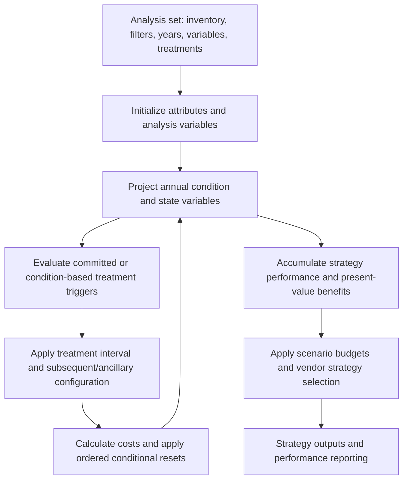

# How the configured PMS and BMS analyses work

This document describes the live **test-service configuration captured on 2026-09-24**. Statements about formulas come from the exported configuration. Where the exact vendor execution behavior is unavailable, it is identified explicitly. The [formula catalog](expressions.md) preserves complete expressions and UUIDs; the treatment catalogs link their actual trigger/reset/cost expressions.

## 1. An analysis set selects the problem

`AnalysisSets` binds the inventory table, inventory filter, condition variable, traffic variable, start/end years, last treatment year, plot horizon, discount/inflation rates, and strategy output tables. `AnalysisSetTreatments` supplies treatments and their order. `AnalysisSetPerformanceIndexes` supplies the variables attached to a set, also with authored order. `BudgetScenarios.AnalysisSetID` connects scenarios to sets; `AnalysisSetBudgetScenarios` contains their category/year budget data and has no AnalysisSetID of its own.

The snapshot has **32 pavement sets using `Analysis` and two bridge sets using `Bridge`**. All captured sets specify discount rate 4 and inflation rate 2. Their horizons differ; do not substitute one statewide set's dates or objectives for every set. The complete settings and mappings are in [analysis-sets.md](analysis-sets.md).

The configuration retains `Type`, `Slope`, `Keep`, `IsReset`, initialization source, discard filter, and other variable flags. These flags should be preserved when reproducing behavior; the API's single-letter enum values are not enough to infer every internal scheduling convention.



This is a logical dependency flow, not a verified trace of the proprietary engine's internal instruction order.

## 2. Pavement initialization and family selection

The pavement expressions use a family key assembled from **pavement type + rehabilitation type + truck-load class + index**, for example `BC_Minor_H_PSI`. The referenced coefficient table contains BC, RC, and OT families, each with Initial/Major/Minor and H/L variants: 18 families × 8 indices = 144 rows.

Coefficient expressions such as `PMS_ancCND_PSI_C1`, `_C2`, `_C3`, and `_CURVE_TYPE` read **`Analysis_Lookup_Perf_Coef`** using that composite key. They do not read the similarly named 187-row `Analysis_Lookup_Performance_Coefficients` table. Its coefficients differ for many shared keys; see [curve diagnostics](curve-diagnostics.md).

Initialization is not universally “set age to zero.” Variables may initialize from an attribute or from an expression. `PMS_ancCND_PSI_Initial`, for example, compares treatment and survey years, selects an initial value by rehabilitation type, and projects from the more recent year to `GSTART_YR` using pavement-specific coefficients. Other variables have their own initializers. [Variables and curves](variables-and-curves.md) records each one.

## 3. Pavement deterioration and equivalent age

Index expressions call `DAL_DCG_INDEXFROMAGE(curve_type, C1, C2, C3, 5, age)`. The captured function metadata describes five regression families but does not expose the DLL implementation. Stored `Curve_Equation` text supplies explicit arithmetic for many rows. Examples include:

- `BC_Minor_H_RDI`: approximately `5 - 0.004 × age²`.
- `RC_Minor_H_PSI`: approximately `5 - 0.1 × age`.
- `BC_Initial_H_SCI`: `5 - 85 × exp(-(115 / age)^0.7)` for age > 0.

The numeric diagnostics evaluate **stored equation text**, with an analytical age-zero limit for the explicit sigmoid examples. They do not assume that the proprietary function exactly matches every stored label. The single Log equation remains unevaluated because vendor handling of its age-zero singularity is not established; the function catalog confirms that LOG is the natural logarithm. Twelve NCI equation strings explicitly contain `Not Predicted`.

`PMS_ancCND_PSI_INDEX_FROM_AGE` explicitly returns zero when the computed value is nonpositive. A raw polynomial going below zero is therefore not, by itself, proof of negative stored PSI. Conversely, a diagnostic must not silently add an upper clamp of five where the captured wrapper does not contain one. Six explicit equations rise briefly above their age-zero value; inspect variable applicability and wrapping before changing coefficients.

Each index has an age variable. `PMS_ancAGE_AGE_PSI` adds one every year. SCI, CSI, and JCI age expressions add one only when the matching hold variable is below one. Hold expressions reduce their counter toward zero. A hold is therefore a **multi-year age-clock mechanism**, not just “leave the index unchanged during the treatment reset.” The exact same-year ordering between hold decrement and age increment still requires vendor execution evidence.

Inverse functions `DAL_DCG_AGEFROMINDEX(...)` find an equivalent age for a post-treatment index. This lets deterioration resume from the improved condition's place on the configured curve. When the curve family changes, reset ordering matters because coefficient lookup expressions read the current family variables.

## 4. Pavement eligibility

`Treatments.TriggerFilterID` points to the real eligibility expression. The lookup table supplies numeric thresholds but is not a complete rule engine.

For thin overlay, the trigger first handles committed projects: while `IS_COMMITTED()` is true and `YR` is at or before the maximum of four program years, eligibility requires a matching treatment in a matching program year. Otherwise it requires length at least 0.5, an asphalt filter, and at least one numeric branch.

Within its ordinary branches, thin overlay reads PSI, SCI, ECI, and RDI bounds using inclusive `>=` and `<=` comparisons. It does **not** simply test every one of the six index windows printed in the lookup. Other treatments have different variable sets, count restrictions, and guards. [Trigger diagnostics](trigger-diagnostics.md) identifies the exact 146 extracted lookup comparisons used directly by captured treatment triggers.

Examples from the current lookup:

| Key | Selected authored windows |
| --- | --- |
| `MICRO_1` | PSI 3.6–4.5; RDI/SCI/ECI 3.5–4.9 |
| `THIN_OVL_1` | PSI 2.0–3.5; SCI 2.5–5; ECI 2.5–4; RDI 2.5–5 |
| `THICK_OVL_1` | PSI 1–3.5; SCI -1–3; several other lower bounds -1 |
| `CRACK_SEAL_1` | CSI 4.3–4.5 in the lookup; the actual formula determines its use |

Two redundancies are mathematical consequences of the captured windows: `THIN_OVL_3` contains `THIN_OVL_2` and `_4`; `MAJOR_CPR_DG_2` contains `_1` and `_3`. This is redundant eligibility, not evidence that the selected treatment is wrong.

## 5. Treatment sequencing, ancillaries, and resets

`IntervalYear`, `IsInitial`, and `ApplyAfterInitial` are treatment-level controls. `TreatmentSubsequents` defines permitted next treatments with order; `TreatmentAncillaries` attaches additional treatment definitions. Do not flatten these into independent eligibility rows. Two subsequent-order ties exist and need vendor tie-breaking confirmation.

`TreatmentResets` records **TreatmentID, FilterID, AnalysisVariableID, ExpressionID, and Order**. Preserve filters and order. A reset can update a condition, age, family, counter, cost, raw measurement, or reporting category; the 962 rows are far more than a six-index delta table.

For **PMS_Thin_Overlay**, the captured order is especially informative:

1. Orders 0–4 add 1.25, capped at five, to ECI, PSI, RDI, SCI, and CCI.
2. Orders 5–9 recalculate each corresponding equivalent age through `AGEFROMINDEX`.
3. Orders 10–13 reset derived IRI, cracking, rutting, and remaining service life.
4. Orders 14–15 set rehabilitation type to `Minor` and recalculate truck-load class.
5. Later rows set yearly cost, reporting categories, treatment counters, and last treatment.

The ages are authored **before** the family-class resets. Reordering these to use new-family coefficients would change the configured sequence and must not be described as equivalent without a vendor trace. CCI also has an explicit index/age reset here; a local engine that always replaces it with a minimum of component indices is making an additional modeling choice.

Bridge resets use the same ordered framework but target component condition ratings, holding/life counters, element-state percentages, and bridge-specific derived variables. The [BMS catalog](bms-treatments.md) retains every reset and filter.

## 6. Bridge deterioration has two distinct mechanisms

### Component rating-life tables

Expressions such as `str_ancCND_DECK` preserve a -1 sentinel in inapplicable cases. For applicable components they construct a key such as `DCK_...` or `DCK_P_...` and a year-column name such as `YR00`, then read `Bridge_Lookup_CR_Life`. The deck counter increments toward a maximum of 50 when its life/hold logic permits; the life counter decreases toward zero.

There are 87 lookup rows: **81 complete component trajectories** with `YR00` through `YR50`, plus six numeric-key coefficient/CR template rows. All 81 trajectories pass the audit's non-increasing, non-null, and 0–9 range checks. It would be incorrect to call the numeric template rows broken merely because their year columns are empty.

The current deck, superstructure, and substructure modifier expressions return 1; their former `Bridge_Lookup_Det_Mod_Factors` calls are commented out. Component-specific initialization and key construction remain important: a complete table does not prove that every possible inventory key resolves. The [BMS walkthrough](bms-analysis.md) expands the exact material/protection branches, holds, and output checks.

### Element condition states

`Bridge_Analysis_Lookup_Element_Curves` contains **40 rows for ten elements**, with CS1–CS4 transition weights and a factor. All 40 base rows contain probabilities in [0,1] summing to one.

The actual element formulas add state- and age-dependent behavior. For element 515, CS1 initialization divides CS1 quantity by total element quantity and multiplies by 100, or returns zero for an absent element. Its next-year CS1 multiplies prior-year CS1 by a retention coefficient reduced by a capped factor×age/100 term. CS2 receives loss from CS1, while CS3 and CS4 receive flows from worse-state transitions. Calls to `GET_ANALVAR_4_YR(..., YR-1)` distinguish previous-year states from current-year states.

This is not merely a generic stationary matrix multiplication: the dynamic factor and use of current CS1 inside the CS2 calculation matter. The row-sum audit verifies the base table, not conservation of every complete runtime path. Treatments can also redistribute states—for example, resetting CS1 to 100 when element quantity is positive, or combining selected state percentages into CS1.

## 7. Bridge eligibility and composite condition

Bridge treatment filters distinguish culverts from other structures, use component ratings and -1 sentinels, and handle committed work. Ancillary deck/paint/joint treatments can be attached to a major maintenance or replacement treatment. `str_STR_MTCE` ORs multiple ancillary eligibility expressions, then applies additional structure gates.

Some current bridge rules reference attributes absent from the live attribute catalog, including program fields and the classification field used in a `LEFT(...,1) <> 'C'` gate. These references are preserved verbatim and listed as unresolved. Direct API probes confirmed two examples are not returned; no claim is made about hidden/deleted metadata or vendor fallback behavior.

The active body of **`str_ancCND_CCR`** is:

```text
if culvert: CCR = culvert rating
otherwise: CCR = 0.30 × deck + 0.35 × superstructure + 0.35 × substructure
```

The old `Bridge_Lookup_CCR_Weights` calculation appears inside `//` comments. Treating those comments as executable would misdocument the current analysis. A weighted CCR variable multiplies CCR by a separate weighting variable; its definition is preserved in the formula catalog.

## 8. Costs, benefits, budgets, and strategy selection

`TreatmentCosts` contains ordered financial/economic expression links and optional filters. Pavement costs use the treatment-cost lookups and expressions; bridge costs can incorporate committed project costs, dimensions, component quantities, and bridge treatment-cost lookups. Units and multiplication factors should be taken from the expressions, not guessed from a treatment label.

The captured function metadata defines `GET4CAV_PVDIFF` as the present-value difference between the current strategy and the Do Nothing strategy across years, with a condition variable, cutoff, weighting variable, and weighting exponent. The PMS benefit expression uses **CCI, ADT, and exponent 0.2**. A separate expression uses PSI. The bridge benefit expression uses its weighted-condition variable and exponent zero. `BudgetScenarios.AnalysisVariableBenefitsID` and `AnalysisVariableCostsID` select the actual objective inputs; performance-index bindings select the additional attached variables. The scenario also exposes AllowDoNothing, IncludeCommitted, UnlimitedBudget, IBCFrontier, StartIBCAtDoNothing, and UseBruteForce controls. Read the selected scenario rather than inferring its objective from a treatment or analysis-set name.

This configuration supports comparing intervention strategies with Do Nothing, applying costs over the analysis horizon, and using scenario budgets. However, the API dump does not reveal the vendor optimizer's internal implementation or establish that it uses the local Python engine's IBC/rolling-horizon algorithm. `ConstraintType`, `UsesAdvanced`, scenario flags, and stored outputs are preserved; no undocumented enum meaning or optimality guarantee is invented.

## 9. Local Python PMS differences that matter

These are observations from the current workspace, separate from the live dTIMS source:

| Local code | Observed behavior | Implication for parity |
| --- | --- | --- |
| `engine/db.py: load_triggers_df` | Preserves lower bounds by default; optional legacy clamp sets them to zero | Enabling the clamp changes live eligibility windows, including -1 sentinels |
| `engine/treatments/triggers.py` | Generic inclusive six-index checks, with additional joint/segment strategy paths | Not identical to every treatment's selective index comparisons and committed branches |
| `engine/optimization/work_program.py: _apply_treatment_resets_polars` | ADDITIVE clips to [0,5]; ABSOLUTE uses max(current,delta); HOLD leaves value unchanged | Generic modes cannot represent all ordered vendor expressions, counters, and conditional resets |
| Same reset function | Recomputes equivalent ages, rounds them to integer, then changes family; recomputes CCI from components | Inverse-age precision and CCI treatment differ from the full vendor configuration unless separately justified |
| `engine/deterioration/models.py: advance_conditions_one_year` | Adds one to each present index-age column before evaluating the family curve | Does not implement the captured per-index hold countdown gates in this function |
| `engine/runner.py: PipelineConfig` | Default benefit power exponent is 0.25 | The captured PMS PV-benefit expression uses 0.2; caller overrides must be checked |

These findings identify parity questions; no local or remote fixes were applied. Exact end-to-end equivalence would require selected inventory records, the exact analysis-set/scenario choice, and vendor-generated per-year traces, including committed branches, hold timing, missing-attribute behavior, and optimizer decisions.

## 10. SQL preparation, workflow definitions, and runtime evidence

The schema follow-up found an additional execution layer outside the treatment expressions. The schema exposes six registered SQL procedures, five of which have callers in `BatchOperationItems`. `Bridge_Analysis_Prep` currently orders SNBI population → element roll-up → counter initialization → budget-category formula transformation. `Analysis_Generate_Segments` calls the highway segmentation procedure before its data import. Five XAML workflows contain another 143 configured operation references.

The execution endpoint confirms recorded runs of the bridge preparation procedures and highway segmentation procedure. One segmentation request on 2026-01-26 failed with a string/binary truncation message; later requests completed, including one on 2026-09-16. These are operation-level records, not per-year treatment/curve traces. The SQL source-text retrieval action returned HTTP 403, so the procedure internals remain unavailable under the supplied credentials.

See [runtime and scripting references](runtime-and-scripting.md) for exact SQL names, callers, execution timestamps, current-versus-historical ordering, source limitations, and queries against the expanded SQLite database.

## 11. Raw condition measures and GFP

[Raw metrics and GFP](raw-metrics-and-gfp.md) traces IRI, cracking percentage, rut depth, and faulting separately from the 0–5 indices. IRI uses an inverse-PSI base curve; rutting uses inverse RDI; cracking uses route-dependent rates and SCI/CCI age expressions; faulting retains its initialized value unless explicitly reset. IRI, rutting, and cracking have curve shifting enabled. Stored IRI examples demonstrate offsets from the base conversion. Overall pavement GFP consumes the raw-measure categories, with faulting for RC and rutting otherwise. The local Python CCI-based network GFP is a different calculation.

## 12. Expanded BMS investigation

The [BMS walkthrough](bms-analysis.md) documents both deterioration models, all sixteen treatments and 554 resets, 38 scenarios, costs and benefits, missing metadata, and concrete configuration review items. Twelve saved strategies were matched to six inventory bridges using `ForeignKey = Bridge.ID`; the API entity key `ElementID` is different. The follow-up passed 2,376 output comparisons and 4,080 element conservation/bounds checks, with two synthetic missing-component branch differences retained for review.
