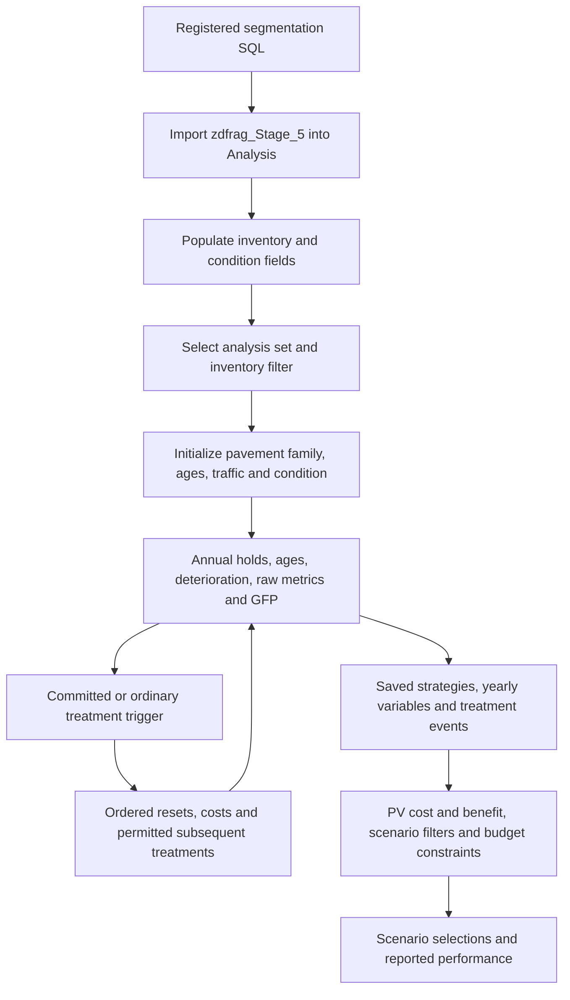

# PMS analysis: configured dTIMS behavior, verified NHS replay, and local implementation

*dTIMS snapshot: September 24, 2026. Integrated NHS replay and local-code comparison: September 25, 2026.*

This is the configured **test-service PMS**, read through Windows curl on T20DOHB05L09456 at 192.168.1.63. It covers all **32 pavement analysis sets, 50 registered PMS variables, five attached-variable profiles, 19 treatments, 408 reset rows, and 91 budget scenarios**. Existing results were sampled across Non-NHS, NHS, and Turnpike sets. No configuration, import, workflow, analysis, or optimization was executed or changed.

The NHS follow-up now reproduces **87,210 numeric outputs and 48,600 GFP classifications** from saved initial conditions and prescribed treatment schedules. The current local application is **not behaviorally equivalent**: it uses a different CCI definition, unshifted annual curves, different benefit-projection equations, and CCI bands instead of the captured raw-metric GFP classifier. These differences remain even when both implementations receive the same initial states and coefficients.

Sections 1–8 describe the captured dTIMS configuration. [Section 9](#9-how-the-verified-nhs-replay-is-implemented) incorporates the NHS download, executable model, validation, and historical-workbook limitations. [Section 10](#10-comparison-with-the-current-local-application) follows the actual application call path in this checkout and compares every major analysis stage. [Section 11](#11-order-of-work-to-achieve-behavioral-parity) identifies the work needed for parity. “Current local implementation” means the source under `api/`, `engine/`, and `pipeline/` reviewed for this update, not the older root-level `pms_optimization_engine.py` prototype. No deployed local run or PostgreSQL configuration was sampled for the original section-10 comparison; code behavior and controlled numerical comparisons are identified separately.

The subsequent [non-Interstate NHS spatial and deterioration overlay](../nhs-overlay-2026-09-25/README.md) captures actual local configuration 1 and the exact route/NHS filter used by saved run 270. It finds **1,374.196 shared miles**, matching values for all **144 coefficient rows**, substantial directional coverage and cracking-input differences, and divergent untreated trajectories over **850.914 sampled shared miles**. That report uses each implementation's own captured initial conditions, families, and ages; section 10's controlled replay instead supplies identical states to isolate engine behavior. Current local inputs do not reconstruct run 270's historical input snapshot, and a selected-treatment-program comparison remains unavailable.

Start with this walkthrough; use the [configuration register](pms-configuration-register.md) for every set, variable order, formula binding and scenario, [treatments](pms-treatments.md) for every trigger/reset, [budgets](pms-budgets.md) for allocations, [saved examples](pms-output-examples.md) for measured output evidence, and [findings](pms-findings.md) for review items. Original formulas, UUIDs, response hashes and diagnostics are preserved in [SQLite](pms_bms_live.sqlite).



The arrows describe configured dependencies. They do not establish every internal scheduling step of the proprietary engine.

## 1. Build and populate the analysis inventory

`Analysis_Generate_Segments` calls registered procedure `spdFRAG_HWY_ANALYSIS`, then `Analysis_From_dFRAG_SQL`. The import reads **zdfrag_Stage_5**, targets the **Analysis** entity, uses server-side input, imports elements, and has **RemoveAllElements=true**. ImportAttributes and ImportAttributeValues are false. Its column-mapping endpoint returns zero explicit mappings. The procedure body remains unavailable: the documented source-retrieval action returned HTTP 403 in the scripting investigation. Registration and source-table names do not reveal the full SQL segmentation algorithm.

`Analysis_Population_Pavement` then contains ordered transformations for traffic, truck/coal-route fields, rehabilitation history, raw IRI/rut/faulting/cracking, condition indices, survey years, road attributes and program data. The [complete batch/workflow catalog](runtime-batches-and-workflows.md) gives actual ordered callers; [raw-metric provenance](raw-metrics-and-gfp.md) traces the condition-field transformations. Historical year-named transformations coexist in the configuration, so one should follow their filters and authored order rather than pick a transformation by its name alone.

Five decoded XAML workflows and SQL/batch execution references are retained in [runtime and scripting](runtime-and-scripting.md). Analysis-set after-execute hooks and scenario workflow hooks are null in this snapshot. The existence of a workflow does not show automatic execution after a PMS run. Previously captured runtime history includes a segmentation truncation error and later completed executions; that history is separate from current configuration.

The sampled strategy identity joins as **strategy.ForeignKey = Analysis.ID**, not the OData entity key ElementID. Six current inventory rows match all twelve sampled NEW762 strategies. Twelve older NHS/Turnpike strategies no longer match current IDs. Replacement import behavior is a plausible explanation, but this audit cannot prove when or why each identity changed.

## 2. Select a set, scope and analysis horizon

Each set supplies its inventory filter, start/end years, treatment application end, performance plot end, treatment list/order, performance-variable order and output tables. All 32 currently store discount **4%** and inflation **2%**. CCI is the configured condition variable and ADT the traffic variable. Representative current settings are:

Set | Current horizon | Strategy output
--- | --- | ---
PMS_NHS | 2025–2042 | NEW517_STRATS
PMS_TURNPIKE | 2026–2050 | NEW311_STRATS
DEL_STIP_2026_Non_NHS_ALL_NETWORK | 2026–2040 | NEW762_STRATS

Filters—not names—determine membership. For example, inspect the bound filter on a district/NHS/Interstate set before interpreting its coverage. The register links every filter to its expression.

Twenty-four sets share the common 46-variable profile. Five have 47 variables, adding `PMS_bCAV_Allowable`. PMS_NHS_TENTH has 44, omitting yearly treatment and Exclude. PMS_NON_NHS_NON_TURNPIKE substitutes Allowable for Exclude; Turnpike has 45, omitting Exclude. In total 47 distinct variables are attached somewhere. The three TEMP coefficient variables are registered but not attached to these profiles; coefficient **expressions** are still referenced directly.

The common profile orders family attributes first; holds before ages; traffic/truck class before condition; then raw metrics, classifications, annual cost, cumulative values, counters, yearly treatment and Exclude. The full numeric order is in the register. Saved outputs can have shorter slot ranges than today's configured horizon; no producing configuration version or per-row execution ID is exposed.

## 3. Initialize the pavement family and condition

[PMS_ancOBJ_Pave_type_Initial](expressions.md#e-09c7fde6-cc65-4701-9ecc-e3e705983d08) maps SURF_TYPE_ARAN JCP/CRC to RC and everything else to BC. That includes blank/unknown surfaces. An older OT branch is commented out. The family combines modeled pavement type, rehab type and truck class, then an index suffix, such as `BC_Minor_H_PSI`.

Rehab type initializes from Analysis.REHAB_TYPE. Truck class initialization and [PMS_ancTRF_Truck_Load](expressions.md#e-0a9b6cd0-79b4-4da2-a728-ab165b8fe547) use the Coal_Rte_Id default test: default gives L, otherwise H. The old 10-million-ESAL threshold appears only in comments. All twelve inventory-matched saved strategies start H even though literal replay against today's empty coal-route fields gives L; the producing configuration and vendor field-default behavior are needed to resolve that difference.

All seven condition ages initialize as `MIN(GSTART_YR - REHAB_COMPLETION_YEAR, 15)`. The expression does not floor at zero. Initial holds and treatment counters start at zero. ADT and ESALs initialize from inventory attributes.

**CCI initializes directly from Analysis.CCI.** The separately stored `PMS_ancCND_CCI_Initial` minimum-of-components expression is not its bound initializer. PSI/CSI/ECI/JCI/RDI/SCI initializers contain their own survey/rehab-year adjustment formulas, including hard-coded deterioration coefficients, applicability gates and defaults. They are not simply evaluations of the active family lookup at the initial age. For example, PSI chooses a post-rehab baseline when rehab is at least as recent as the condition survey; otherwise it starts from inventory PSI and projects toward the analysis start. Some inapplicable indices initialize to zero.

Raw IRI, rutting, faulting and cracking initialize separately from their mapped inventory/raw-metric expressions. They are not interchangeable with PSI, RDI, SCI or CCI. NULL/default transport values require care: raw API NULL is not proof that the engine treats it identically to Python None or a numeric zero.

## 4. Advance holds, ages, traffic and deterioration

For CCI, CSI, ECI, JCI and SCI, hold becomes `hold-1` when hold>1, otherwise zero. Their ages increment only when hold<1. PSI and RDI ages increment unconditionally. The authored order puts hold updates before age updates. Replay using current hold and previous age matches 1,778 sampled untreated age values and 1,270 hold values, excluding slots 0/1 and treatment years.

[PMS_ancTRF_ADT](expressions.md#e-bdc90f36-8bfb-4a9b-bef3-1ae1613029d7) multiplies prior modeled ADT by `1 + Analysis.ADT_20_Yr_Factor/100` each annual call. Despite its field name, the expression uses that value as an annual percent; it does not take a twentieth root. Sixty-three comparisons with non-null matched inventory factors agree. **[PMS_EXP_ESAL_Annual](expressions.md#e-6a7fe45e-da93-4828-bb72-bb1024709eee) currently returns zero unconditionally** because its first condition is TRUE. All 254 sampled untreated annual ESAL values agree. This does not erase the separate inventory ESAL initialization or make ESAL the active truck-class selector.

Active coefficient expressions read **Analysis_Lookup_Perf_Coef**, with 144 rows across 18 families and eight index codes. Its 137 Polynomial, three Linear, three Sigmoid and one Log rows are catalogued in [curve diagnostics](curve-diagnostics.md). The 187-row `Analysis_Lookup_Performance_Coefficients` table is an alternate source, with 96 matching keys differing in at least one coefficient/type/maximum. It is not interchangeable with the bound table.

The ordinary annual index expressions call `DAL_DCG_INDEXFROMAGE(type,C1,C2,C3,5,age)` and generally floor the base result at zero. Polynomial stored equations are second-order, `5+C1*age+C2*age²`; the mere presence of C3 does not make them cubic. Explicit equations were sampled separately over ages 0–50, with unsupported/singular cases recorded rather than invented.

**CCI has its own annual family curve:** [PMS_ancCND_CCI_INDEX_FROM_AGE](expressions.md#e-578c4796-95a5-4bd9-8570-107663e586da). It does not recompute the minimum of component indices every ordinary year. [PMS_ancCND_CCI_Annual](expressions.md#e-94dffbab-78c7-49ea-8e1c-83b282ff8d7e) is a separate min-components-minus-0.5 formula, used as a reset by generic PMS_PM_Asphalt and PMS_PM_Concrete, whose current triggers are False.

Curve filters also matter. ECI/SCI have asphalt-filtered curve bindings with a constant-5 fallback; CSI/JCI have concrete-filtered bindings with a constant-5 fallback. RDI's expression explicitly returns zero for RC. Consequently, an inapplicable index's initializer, annual fallback and treatment reset can differ.

All seven indices and raw IRI/PCRK/RUT have **ShiftCurve=1**; faulting does not. A stored value must not be treated as the unshifted base equation. The `audit_pms_curve_offsets` table retains 2,203 base/stored comparisons. One sampled untreated CCI trajectory starts 0.530076 versus base 3.875, preserving an offset near -3.344924 at slot 2 before later bounds/treatment effects. Saved CCI spans -1 to 99 and saved IRI reaches 550.852. Thus the base floor/cap alone is not an asserted final-output bound. The NHS follow-up resolves the annual shifting behavior for its tested paths: preserve the anchor offset, floor the base at zero, and floor the final shifted index at -1. Section 9 gives the equations and validation; this does not establish every proprietary edge case or validate sentinel inventory as physical condition.

## 5. Compute raw distress, GFP and remaining life

Metric | Configured annual base calculation | Important distinction
--- | --- | ---
IRI | `MIN(500, 65 - LN(PSI/5)/0.0066)` for PSI>0; otherwise 500 | Raw roughness in in/mi; initialization and curve shifting can change the stored trajectory
Cracking / PCRK | 0.15, 0.37 or 0.56 times the age expression | Uses SCI age expression for BC, CCI age expression otherwise; that expression includes hold/increment logic
Rutting | `((5-RDI)/6.65)^(1/1.41)` | Raw rut depth, not RDI itself; shifted annual variable
Faulting | Current faulting value | Annual self-assignment; treatment resets can change it

Cracking selects 0.15 for exact Sign code `1`, 0.37 for non-`1` with HPMS code `1`, otherwise 0.56. Field-code interpretation must be distinguished from OData display labels. The [raw-metric document](raw-metrics-and-gfp.md) and [reset map](raw-metric-reset-map.md) provide complete input and per-treatment details.

GFP uses strict thresholds: IRI <95 Good, >170 Poor; rut <0.2 Good, >0.4 Poor; fault <0.1 Good, >0.15 Poor. Cracking <5 is Good; Poor is >20 for BC and >15 otherwise. Equality at either boundary is Fair. Overall RC uses IRI/cracking/faulting; the other branch uses IRI/cracking/rutting. All three Good means Good; at least two Poor means Poor; otherwise Fair. There is no missing-value exclusion in these classifiers: negative/zero IRI can be Good.

All **1,620** classifier comparisons agree across the 24 sampled strategies, including RC. The earlier sample's 252 missing-pavement-type skips are now addressed by complete variable fetches in this supplemental sample; the earlier evidence tables remain intact.

Remaining life uses `MAX(ageAtThreshold - ageAtCurrentIndex,0)` for individual indices, then rounds a minimum across five components. BC uses CCI/ECI/PSI/RDI/SCI. The other branch uses CCI/JCI/PSI/**RDI**/CSI; RDI's presence there is literal, even though its RC annual expression returns zero. Thresholds for exact Sign codes 1/2/3/4 are 2.5/2/1.5/1, with 2.5 fallback. `DAL_DCG_AGEFROMINDEX` and its behavior outside a valid curve domain are proprietary, so exact RSL reproduction is not claimed. Hold durations also should not be added to this result without evidence of engine semantics.

## 6. Generate treatment alternatives and apply ordered resets

All 19 registered PMS treatments are Major, with IsInitial=true and ApplyAfterInitial=false. PMS has no attached ancillaries in this snapshot. Each set attaches only its listed treatments; global registration does not imply a treatment can appear in every set. Subsequent-treatment links and interval settings further constrain strategy generation. Thick overlay has tied subsequent orders, documented in [static findings](findings.md); tie-breaking is not exposed.

Most trigger expressions first test a committed strategy while YR is at or before the latest of four committed years. In that branch, the named treatment and matching programmed year control eligibility. After that window, ordinary condition gates apply. Ordinary threshold comparisons generally use inclusive bounds from Analysis_Lookup_Triggers; the [trigger diagnostics](trigger-diagnostics.md) resolve all 146 extracted comparisons and identify redundant OR branches.

Treatment group | Ordinary eligibility highlights
--- | ---
Thin/thick overlay | Length≥0.5, BC, configured PSI/SCI/ECI/RDI windows
County thin | Length≥0.5, BC, CCI 1–2, inventory ADT≥250
County thick | Length≥0.5, BC, inventory ADT≥200, and low CCI plus inventory IRI>150 or configured patch-area percentage≥15
County chip | Length≥0.5, BC, chip count≤2, modeled ADT<1000, 2.8<CCI<4, lane/sign/I-68 gates
County micro | Length≥0.5, BC, 5–7 years after a recorded county thick overlay
Major/minor CPR and saw/seal | Length≥3, RC, configured concrete condition windows
PM micro | Length≥3, BC; specified 5–7-year post-treatment branch or configured micro-count/condition branch
Other seal/preservation treatments | Individual sign, road, lane, condition and count gates; full expressions in treatment catalog
Reconstruction | Interstate/I-68 eligibility, length≥0.5 and severe condition gates; one SCI branch has a mismatched ECI lower bound
Special Fair-GFP treatment | Overall GFP=FAIR alone
Ultra-thin | Ordinary branch FALSE; committed branch remains
Generic PM Asphalt / Concrete | Bound trigger is False

The special `PMS_Fair_Treatment_For_GFP_Analaysis_70P_Good` is attached to DEL_STIP_2026_INTERSTATES_ONLY, DEL_STIP_2026_NHS_ONLY_NO_INTERSTATE, DEL_STIP_2026_Non_NHS_ALL_NETWORK and PMS_TURNPIKE. Its hard-coded 300,000-per-lane-mile cost and broad trigger make it materially different from a standard condition-window treatment. Saved events include invalid/sentinel-like CCI above 96 before resetting it to 5.

Reset order is part of the model. Thin overlay first increases ECI/PSI/RDI/SCI/CCI by 1.25 capped at 5, then computes equivalent ages, resets raw metrics/RSL, changes rehab family to Minor, updates truck class/cost, recomputes GFP, clears counts and records the last major treatment. Equivalent-age calculations precede the family change in the authored order. A reproduction that switches family first would be a different calculation.

Thick overlay assigns relevant ages to 1, assigns seven indices to 5, resets raw metrics/RSL and then sets rehab type Major. Reconstruction resets all seven ages to 1 and indices to 5, faulting to zero, and later sets pavement BC and rehab Initial. CPR uses `MAX(4.5,current)` for affected indices, preserving already better condition. CCI improvements are +0.75 for micro, +0.5 for chip, +0.25 for cape, +1 for ultra-thin/saw-seal, all capped at 5. Crack seal has no direct CCI reset. Every other reset, applicability filter and counter effect is retained in the 408-row catalog.

Direct constant/self-based index arithmetic matches **126** sampled treatment-year changes. Three CSI/JCI comparisons cannot be explained from the recorded zero Before fields; saved After values above 4.5 are consistent with the reset's preservation branch, but a complete internal event trace is missing. All 23 annual saved financial costs equal their saved treatment-event cost totals.

## 7. Price treatments and compute strategy objectives

Ordinary financial costs usually multiply **inventory length × total lanes × unit rate × inflation**. The lane expression falls back to 2 when Lanes_Total is its metadata default. Statewide rate keys contain a literal `_1_` plus pavement type; they do not dynamically substitute the route Sign. County rates use the treatment name and the first two County characters. Thick-overlay cost adds 1.2 for Sign strings starting with 1. Inflation is `(1+GINFLATION)^(YR-1)`.

All eleven inventory-matched event costs agree with current expressions when 2% is represented as .02 and NULL total lanes is assumed to act as its declared default, invoking the two-lane fallback. This is explicitly a **conditional** replay, not proof of every engine NULL coercion.

The authored committed-cost override generally checks additional slots 2–4 and returns supplied costs directly; it does not explicitly check slot 1 or impose a nonnegative guard there. The trigger covers all four slots. The engine might handle the first commitment separately, but no matched committed inventory or internal implementation was recovered to establish that contract. Do not replace a saved committed cost with a formula-derived ordinary cost on this evidence alone.

Annual cost reads the strategy financial-cost function. [PMS_ancPV_Cost](expressions.md#e-49f25264-5236-46ff-b36a-b7f14616107d) uses GET4CAV_PV(yearly cost) **divided by perspective length**. Its result is normalized cost, not simply the undiscounted event total. [PMS_ancPV_Benefit_All](expressions.md#e-d16f64d2-f26d-4aa8-bb85-3857251e23af) uses GET4CAV_PVDIFF on CCI versus Do Nothing, with ADT weighting power 0.2 and literal cutoff argument 0. Function metadata documents the comparison and weighting but does not fully specify numerical integration, discount timing or cutoff edge behavior. The separate PSI-benefit variable exists but is not the benefit binding of the 90 benefit-bearing PMS scenarios.

The minimum-cost benefit-like variable returns zero for DN/MO and otherwise 2,000,000 minus PV cost. The separate Yearly_Miles_Poor variable initializes to zero with no captured annual/reset binding; PV_COST_LOS reads its PV. Stored poor-mile cost expressions use fixed network denominators (for example Interstate 869.82 and NHS-all 1845.51), but their presence does not show they populate that discrete variable. The Category variable uses PSI and budget override names to produce G/P/empty; it is distinct from raw-metric Good/Fair/Poor.

## 8. Apply scenarios and inspect selected results

Ninety of 91 PMS scenarios bind CCI benefit and all 91 bind PMS_nCAV_PV_COST. DEL_INTERSTATES_MINIMUM_COST has no benefit binding and uses PMS_bCAV_Allowable, whose active expression is TRUE. Sixty-eight scenarios bind PMS_bCAV_Exclude in the API field **AnalysisVariableAllowableID**. That expression returns true when a committed strategy's yearly treatment names mismatch the programmed sequence; DN/MO/uncommitted return false. This naming/polarity contract requires vendor confirmation before describing true as universally accepted or rejected. Twenty-two have no allowable variable.

The budget catalog preserves **1,582 category/scenario rows and 79,100 annual cells**, including zeros, plus all scenario flags, filters, rates, dates and raw optimization/result codes. UnlimitedBudget, IncludeCommitted, AllowDoNothing, IBC frontier/start and brute-force settings must be read per scenario. Scenario names do not establish those flags. The captured BudgetScenarioAnalysisVariables table is empty.

The schema separates output into strategy identity/flags (`*_STRATS`), yearly variables (`*_Y`), treatment events/costs (`*_T`), and scenario evaluation/selection (`*_B`). The `_B` schema advertises present-value benefits/costs, ratios, efficient/minimum-cost/selected flags and savings. All three sampled `_B` endpoints returned HTTP 500; NEW762 also failed an unfiltered top=1 request. Therefore this audit cannot recover which of these alternatives was selected, achieved budget totals, or independent evidence of optimality. Existing execution logs can say “The optimal solution was found,” but that is the service's status text, not a recovered solution certificate.

## 9. How the verified NHS replay is implemented

### 9.1 Data actually downloaded

The primary source is analysis set **DEL_STIP_2026_NHS_ONLY_NO_INTERSTATE**, ID `0408c6d9-2c9b-4c24-bffb-0669c916dc32`, with output prefix **NEW705_STRATS**. The workbook-named scenario is **DEL_STIP_2026_NHS_ONLY_NO_INTERSTATES_Budget_Scenario**, ID `49797416-0aa6-43d3-84da-48f0c54bf33c`. The singular/plural spelling difference is present in the names; the IDs identify the objects.

The current set starts in 2026 and ends in 2042, with treatment/plot end 2041, discount 4%, inflation 2%, nine attached treatments, and 46 attached variables. Saved sampled annual values stop at After15. The current horizon alone does not identify the configuration that produced those saved results.

| Captured data | Coverage | Use |
| --- | --- | --- |
| `NEW705_STRATS` | All 80,533 rows | Generated strategy identities and flags |
| `NEW705_STRATS_T` | All 176,870 rows | Treatment names, slots, and saved costs |
| `Analysis` | All 562 IDs referenced by the strategies | Inventory and source condition context |
| `NEW705_STRATS_Y` | 29,808 rows: 648 strategies × all 46 variables | After0 through After15; 10,368 saved states |
| Annual table not downloaded in full | Service reports 3,704,518 rows | The replay is a diagnostic sample, not complete annual-output coverage |
| Active coefficients | 144 rows | Bound family/index curve equations |
| Configuration and formulas | 148 variables, 129 curve bindings, 791 runtime expressions, 35 treatments, 962 reset rows, trigger and cost lookups | Full captured service tables; these counts include objects outside this one set |
| Scenarios | 16 registrations; 17 category rows for the named scenario | Configuration, not recovered selected-result flags |

Inventory joins use **strategy.ForeignKey = Analysis.ID**, not ElementID. Successful raw responses, reported counts, request URLs, timestamps, errors, and hashes are retained. Downloads were multiple read requests, not a transactionally consistent remote database backup.

The primary deliverables are the [NHS SQLite database](../nhs-curve-replay-2026-09-24/nhs_analysis.sqlite), [review workbook](../nhs-curve-replay-2026-09-24/nhs-analysis-review.xlsx), and [endpoint model forecast CSV](../nhs-curve-replay-2026-09-24/csv/endpoint_model_forecast.csv). The forecast CSV has **9,720 predicted states**, excluding the 648 initial anchors. Original source tables, joined strategy/event CSVs, and formula provenance remain available in the [NHS package](../nhs-curve-replay-2026-09-24/README.md).

### 9.2 State and execution contract

[nhs_model.py](../../scripts/dtims_audit/nhs_model.py) implements `AnchoredModel`; [nhs_evaluate.py](../../scripts/dtims_audit/nhs_evaluate.py) loads data and scores forecasts. This is a separate audit implementation. The application's optimizer does not import it.

Each strategy supplies one After0 state containing seven indices, their ages and available holds, raw IRI/rut/cracking/faulting, pavement type, rehab type, and truck class. The model also receives the decoded Sign/HPMS cracking factor, active coefficients, and prescribed treatment names/slots. **Future saved condition, age, family, and reset values are comparison targets only.**

```text
model = anchor(coefficients, saved_After0, cracking_factor)
for slot in 1..15:
    if slot > 1:
        decrement holds
        advance permitted ages
        calculate shifted indices and raw metrics
    apply this slot's prescribed treatment resets in implemented order
    re-anchor to the resulting state and family after each treatment
    classify raw metrics and compare with saved_After[slot]
```

After1 duplicates initialization before any treatment; the first ordinary annual deterioration is therefore After2. A treatment in slot 1 can still change After1. For calendar display the exporter labels slot `s` as `2026 + s - 1`, explicitly conditional on the current 2026 start year. Treating After0 as a normal first program year introduces a one-year error.

Holds for CCI/CSI/ECI/JCI/SCI decrement before the age test: hold > 1 becomes hold−1, otherwise zero; age increments only if the resulting hold < 1. PSI/RDI advance without holds. The model retains supplied fractional equivalent ages. It does not round them to integer years.

### 9.3 Curves, offsets, and raw metrics

For an applicable index, family is `pavement_rehab_truck`, such as `BC_Initial_H`; the lookup key adds the index code. With anchor age `a0`, anchor index `I0`, and the configured base equation `f`:

```text
Polynomial: f(a) = 5 + C1*a + C2*a²
Linear:     f(a) = 5 + C1*a
Sigmoid:    f(a) = 5 - C1*exp(-(C2/a)^C3), with f(0) = 5

b(a) = max(0, f(a))
offset = I0 - b(a0)
I(a) = max(-1, b(a) + offset)
```

The final **−1 floor is an empirical engine-behavior result**, not text copied from the configured `MAX(0,...)` expression. It was selected using the earlier 24-strategy sample from other output tables before validating NEW705; [development evidence](../nhs-curve-replay-2026-09-24/model-development.json) retains comparisons against zero and no final floor. The polynomial is quadratic; C3 is not a cubic term. The replay supports analytic descending-branch inverses for Polynomial, Linear, and Sigmoid. Log is explicitly unsupported in this audit model; its presence in the coefficient catalog is not proof of validation.

**CCI uses this same independent anchoring contract on its own CCI curve.** It is not overwritten by the minimum of PSI/RDI/SCI or PSI/CSI/JCI. Applicability is modeled for CCI/PSI in both BC and RC, ECI/SCI/RDI in BC, and CSI/JCI in RC. Inapplicable component placeholders are excluded from the physical-condition accuracy counts and left blank in the primary forecast CSV.

Raw distress has separate anchors:

```text
g(PSI) = min(500, 65 - ln(PSI/5)/0.0066), or 500 if PSI <= 0
IRI(t) = g(PSI(t)) + [IRI0 - g(PSI0)]

h(RDI) = ((5-RDI)/6.65)^(1/1.41)
RUT(t) = h(RDI(t)) + [RUT0 - h(RDI0)]

PCRK(t) = PCRK0 + factor*(relevant_age(t) - relevant_age0)
FLT(t) = FLT0 until an applicable treatment reset
```

IRI remains roughness in **inches per mile**, rut/fault remain raw depths, and PCRK remains cracking percentage. The IRI base cap of 500 is applied **before adding its offset**; final shifted IRI can exceed 500. The cracking factor is 0.15 for Sign code 1, otherwise 0.37 for HPMS code 1, otherwise 0.56. BC uses SCI age; RC uses CCI age. OData code/display strings are decoded at their first hyphen; NHS membership is not substituted for HPMS code 1.

The GFP implementation uses the strict raw thresholds and three-measure rule in section 5. The replay computes IRI, rut, fault, cracking, and overall MAP21 classes separately; 48,600 comparisons means five classes per predicted state, not 48,600 independent pavement segments.

### 9.4 Treatment reset behavior that was exercised

The full forward replay includes **320 events: 277 thick overlays, 31 thin overlays, seven minor CPR treatments, four microsurfacing treatments, and one reconstruction**. These are generated alternatives with matched prescribed schedules, not confirmed optimizer selections.

| Treatment | Index/age behavior | Raw metrics and family |
| --- | --- | --- |
| Thin overlay | +1.25 to ECI/PSI/RDI/SCI/CCI, capped at 5; invert those reset values on the **old** family, retaining fractional ages | IRI uses the smaller of prior IRI and reset-PSI base IRI; cracking uses its minimum-protected age expression; rut uses reset RDI; then switch to Minor and re-anchor |
| Microsurfacing | Same five-index sequence, +0.75 | IRI minimum-protected; cracking assigned directly from reset age logic, so it is not the thin-overlay minimum rule; rut from reset RDI; Minor |
| Thick overlay | Seven indices to 5; relevant ages to **1** | IRI and cracking minimum-protected; rut reset; switch to Major and re-anchor |
| Minor CPR | CCI/PSI/CSI/JCI to `max(4.5,current)`; those ages to **1** | Preserve better IRI/cracking through minimum rules, faulting to zero, switch to Minor |
| Reconstruction | Seven indices to 5 and ages to **1** | IRI 65, age-based cracking, rut/fault zero; change pavement to **BC**, rehab to Initial |

The cracking reset expression includes its own age increment when the hold test permits it; it is not simply `factor × reset_age` for every treatment. `AnchoredModel.apply` implements these explicit distinctions and returns a new anchor after the reset/family change. Truck class stays at the supplied H value, which agrees with every sampled saved reset; the test does not establish the vendor's truck-class initializer.

Preservation, special Fair-GFP, and major CPR branches exist in the audit model but are **not exercised by these 320 events**. Other registered PMS treatments, full hold/counter reset behavior outside the tested paths, costs, triggers, RSL, and optimizer objectives are not implemented by this small forecaster. Their captured authored rules remain in sections 5–8 and the linked catalogs.

### 9.5 What the validation establishes

| Check | Result | Interpretation |
| --- | --- | --- |
| Full forward numeric replay | 87,210 / 87,210 within 1e-6; largest absolute error 1.42e-14 | Initial state plus event schedule is sufficient for the tested applicable metrics |
| Full forward GFP replay | 48,600 / 48,600 | All five classifications agree on all 9,720 predicted states |
| Between-treatment replay | 84,337 numeric and 47,000 classifier matches | Separate diagnostic re-anchoring at saved post-treatment states; overlaps the full replay, so do not add it as independent validation |
| Initializers from current inventory | 3,978 / 3,984 within 1e-6 | Conditional numeric-NULL-to-metadata-default substitution; not complete startup parity |
| Artifact validation | 29 checks passed | Counts, joins, response hashes, workbook preservation, comparisons, and links; not a certificate of optimization or real-world prediction |

The six initializer differences are two SCI values (`30200520000EB-045.170-1` and `2030817000000-000.000-1`: saved −0.1309 versus replay 0) and four CSI/JCI values (`50200600000EB-000.000-1` and `1930009000000-012.260-1`: saved 5 versus replay 5.00002). These are retained, not rounded away. The model starts from saved After0 for its primary forecast, so it does not depend on resolving those initialization differences.

Represented saved families are BC_Initial_H, BC_Major_H, BC_Minor_H, RC_Initial_H, and RC_Minor_H. Exact reproduction of this sample does not validate every one of the 18 configured families, every treatment, future field performance, or dTIMS optimization internals. See the [full replay details](../nhs-curve-replay-2026-09-24/model-and-validation.md) and [validation report](../nhs-curve-replay-2026-09-24/validation.md).

### 9.6 April workbook and selected-scenario boundaries

The April construction-program workbook contains **382 events on 378 segment names**, totaling **$765,091,758.87**. Its two sheets repeat the same events and condition/cost values; they must not be added together. Its condition fields are initial/inventory-like snapshots, not a measured annual deterioration series. Its Year field is the treatment year.

There are 332 exact current-inventory name matches, of which 49 have changed road/from/to/lane/length geometry and 283 have matching extents. Forty-six workbook names have no exact current match. Of the matched names, 316 have an exact complete treatment-name/year sequence among generated alternatives; their 320 events include 269 costs matching to a cent and 51 different costs. The current matched-event cost total is $641,317,800.30 versus $654,374,366.52 for that workbook subset. Neither subtotal represents total selected-scenario expenditure.

The **primary endpoint forecast does not need the workbook's condition values**. The supplemental workbook forecast uses its measurements and schedules plus current missing rehab/survey/family/age/raw-anchor context. That is a conditional hybrid forecast, not an exact reconstruction of April. The [coverage report](../nhs-curve-replay-2026-09-24/coverage-and-differences.md) preserves the unmatched names, input and geometry comparisons, and full download counts.

`NEW705_STRATS_B` returns HTTP 500 even for top=1; selected-scenario reads also fail. `GetStrategyExport` fails with an invalid `ma` column and `GetBudgetData` returns an empty list. Consequently, exact schedule matches do **not** establish selected flags, achieved budgets, or optimality. No optimizer was run to replace those unavailable results.

## 10. Comparison with the current local application

> **Update (PMS v1.6, 2026-09-25):** the application now implements the verified model: `engine/condition/dtims_state.py` (anchored curves with the −1 floor, CCI on its own curve, holds, raw IRI / rut / cracking / faulting, ordered resets with the new family and re-anchoring, MAP-21 GFP by lane-miles) is used by runs, benefits, MILP-assist, Validate and the outlooks, and `tests/engine/test_dtims_state_replay.py` reproduces a sample of these NEW705 strategies within 1e-6. Starting state, trigger gates (CCI, counters, years since, Sign / I-68, ADT, lanes, committed-only, intervals, dTIMS sequencing), every eligible alternative per joint, dTIMS unit costs and a discounted benefit are ported for the 14 PMS treatments. Not ported: county treatments, Fair-GFP, PM Asphalt / Concrete, four committed slots, RSL and the scenario PV-cost objective. The comparison below describes the application before v1.6.


### 10.1 Actual execution path and evidence scope

The mounted app run path is [api/routes/runs.py](../../api/routes/runs.py), `_execute_run` → `_execute_run_in_config`. It enters the run's `use_config(config_id)`, loads `analysis_segments_cfg` plus that configuration's treatments/triggers/resets, and calls one of:

| Path | Entry point and role |
| --- | --- |
| Default `optimizer="greedy"` | [generate_work_program_chunked](../../engine/optimization/chunked.py): joint-based selection, resets, annual advancement, and network reporting |
| Enabled optional constraints | [generate_constrained_work_program](../../engine/optimization/constrained_work_program.py): wraps the same engine, including iterative target weighting |
| Opt-in `milp-assist` with a Good/Poor target | [run_milp_assist](../../engine/optimization/milp/pipeline.py): candidate precomputation and HiGHS selection with a fixed-plan condition simulation |
| Interactive Run Validation | [RunContext](../../api/validation/context.py): reloads the run's config/network and simulates a supplied plan using the same reset/annual mechanics |

The app bypasses `engine.runner.run_optimization_pipeline`. The root `pms_optimization_engine.py` and its raw-metric power-curve treatment library are also not this app's execution path. However, `project_deterioration_polars` **is still active** through benefit scoring even though it uses older equations. Treating all older helpers as unused would miss an important source of result differences.

This review identifies actual function bodies, not just comments. Source-code hashes are saved in [pms-local-comparison/source-code-sha256.json](pms-local-comparison/source-code-sha256.json). The checkout's Git HEAD was `6a0b43417dc8caa8fe7c7df18d88ec6d8e59fd43`; file hashes are the more precise record of the reviewed source. Active PostgreSQL configuration values, production deployment revision, and a particular local run's achieved results were not independently captured. Differences described as code behavior do not assert which configurable values a deployed run selected.

### 10.2 Inventory, initial conditions, families, and time

| Concern | Captured dTIMS / verified replay | Current local implementation and consequence |
| --- | --- | --- |
| Analysis unit | Vendor `Analysis` elements built through registered segmentation/import logic; source SQL body unavailable | [Pipeline stages](../../pipeline/stages.py) build survey/LRS segments; runs optimize whole joints containing those segments. Matching a route name alone cannot align these units |
| Data refresh | Registered SQL, transformations, and XAML/batches | Current `pipeline/` has staged refresh, logs, joint builds, and config reclassification. The older local schema-review document describes an earlier state and is not current proof that every row has fixed 0.1-mile length |
| Length and survey provenance | Vendor inventory Length and survey/rehab fields | [Current import](../../scripts/import_pavement_data.py) computes `end_mp - begin_mp` and stores `survey_year`/joint-build information. This code improvement does not prove a deployed dataset has been refreshed |
| Stored condition | CCI directly from inventory; other indices have bound survey/rehab/start-year initializers | Import preserves populated survey indices, fills remaining null/NaN component indices with 5, and family classification recomputes CCI. It does not execute the captured PMS initialization expressions |
| Initial ages | `min(start year - rehab completion year,15)` in the captured initializer; primary replay uses saved ages directly | [pipeline/families.py](../../pipeline/families.py) infers per-index equivalent ages from condition, rounds to integer, clips 0–100, and treats index ≥4.99 as age zero. These are different starting coordinates |
| Inverse implementation at import | Replay supports explicit Polynomial/Linear/Sigmoid inverses on applicable tested paths | `pipeline.families.compute_ages` has a Linear case and otherwise uses a polynomial root; it does not dispatch to the general Sigmoid/Log inverse helper. Families using those types require separate review |
| Pavement type | JCP/CRC → RC; other/unknown → BC in current bound initializer | Configurable ordered rules can assign BC, RC, or OT. Shipped rules give other/unknown surfaces OT |
| Truck class | Captured coal-route metadata-default test; all replayed states H; full initialization unresolved | Shipped rules use coal-route non-null **or truck share ≥10%**. Rules are editable per config. The input named coal_route is documented as LRS layer-15 section data, so its meaning also needs verification |
| Rehab family | Inventory REHAB_TYPE, then authored resets | Shipped family rules start Initial, with later local treatment mapping to Initial/Major/Minor. Custom configurations can differ |
| First annual step | After1 preserves initialization before treatment; first advancement After2 | Main work-program loop selects/applies treatment and advances one year before storing year-1 condition. Its year-1 report is not directly equivalent to dTIMS After1 |
| Traffic evolution | Configured annual ADT multiplier; annual ESAL expression currently zero | Annual condition loop does not advance AADT or ESAL state. Benefits use loaded/aggregated AADT |

Configuration scoping is present locally: [engine/config.py](../../engine/config.py) and [engine/db.py](../../engine/db.py) read `configs`, `segment_families`, and config-owned rule tables. It would be inaccurate to describe today's engine as always hardcoded to Low truck families. Its family loader normally requires database curves; hardcoded fallback is opt-in via `PMS_USE_HARDCODED_CURVES=1`. No specific config's 144 coefficient values are asserted identical to the September endpoint snapshot in this comparison.

### 10.3 Three different curve calculations exist

Let `a` be current age, `n` elapsed annual advances, `I0` supplied current condition, and C1/C2 the captured coefficients. [engine/deterioration/models.py](../../engine/deterioration/models.py) currently contains both annual and benefit-projection implementations:

| Calculation | Formula / operation | Resulting difference |
| --- | --- | --- |
| Verified replay | `max(-1, max(0,f(a+n)) + I0 - max(0,f(a)))` | Preserves measured/run condition independently of equivalent age; lower saturation −1 |
| Local `advance_conditions_one_year` | Increment age, then `_index_from_age_expr(age)` clipped to `[0, initial_value]` | Uses the dTIMS base Polynomial/Linear/Sigmoid forms but **discards the previous condition offset** |
| Local benefit projection, Polynomial | `clip(I0 - C1*((a+n)^2-a^2) - C2*n, 0,5)` | C1 is used as the quadratic coefficient and C2 as the linear coefficient, with subtraction; incompatible with captured `5+C1*a+C2*a²` |
| Local benefit projection, Linear | `clip(I0-C1*n,0,5)` | Opposite sign to the captured `5+C1*a` change when C1 is negative |
| Local benefit projection, Sigmoid | Difference of `imax/(1+exp(C1+C2*a))` logistic curves | Different family equation; captured Sigmoid uses `5-C1*exp(-(C2/a)^C3)` |
| Local benefit projection, Log | Explicit branch is named `logarithmic`; `log` falls through to the power branch | Loader passes curve_type through; the imported `log` name is not handled as the annual helper handles it |
| CCI after annual/projected calculation | Always overwritten by BC `min(PSI,RDI,SCI)` or RC `min(PSI,CSI,JCI)` | Independent CCI curve values/offsets are lost; ECI is excluded from the local BC minimum |
| Inapplicable indices | Local annual/projection pins BC CSI/JCI and RC RDI/SCI/ECI to 5 | Captured initialization, curve fallback, and reset values are not uniformly 5; for example RC RDI annual expression is zero |
| Holds | Local annual function increments all present index ages unconditionally | It has no per-index hold countdown state; local reset mode HOLD means “leave this index/age now,” not “defer deterioration for N years” |

The local general inverse helper supports additional curve types and caps ages; local reset callers round its result. Supporting a named curve type in one helper does not make all callers use the same equation. Several docstrings still describe power deltas or say the implementation “matches dTIMS”; the executable branches above and the saved-output comparisons establish the narrower truth.

**Controlled example using the actual BC_Initial_H PSI coefficients:** start at PSI 4, age 10, C1≈0 and C2≈−0.005. One annual advance produces:

| Implementation | Next PSI |
| --- | ---: |
| Verified anchored replay | **3.895** |
| Current annual engine | **4.395** |
| Current benefit projection | **4.005** |

The annual engine jumps back to the unshifted curve; the benefit projection slightly improves the condition. This disagreement is reproducible without changing coefficients or loading a database configuration. It can affect treatment timing and candidate ranking independently of differences in input inventory.

### 10.4 Raw IRI, cracking, rutting, faulting, and GFP

| Metric | Verified replay | Actual local main run path |
| --- | --- | --- |
| IRI | Advances from PSI with an independent raw IRI offset | `current_iri` is carried unchanged through `_advance_deterioration_polars` and `_apply_treatment_resets_polars` |
| Cracking | Age increment × Sign/HPMS factor, plus anchor; treatment-specific resets | `current_crack` is carried unchanged in those functions; no Sign/HPMS raw-cracking recurrence |
| Rutting | RDI inverse plus independent rut anchor; applicable resets | `current_rut` is carried unchanged |
| Faulting | Holds its value annually; CPR/reconstruction can reset it to zero | `current_faulting` is carried unchanged even at those index-only resets |
| Overall GFP | Three raw measures; all Good → Good, at least two Poor → Poor, otherwise Fair | `_calculate_network_gfp`: CCI ≥3 → Good, CCI ≥2 → Fair, otherwise Poor; length-weighted totals |

The implementation does contain [PSI/IRI and RDI/rut inverse helpers](../../engine/condition/indices.py), plus `_sync_raw_measurements_from_indices` in [work_program.py](../../engine/optimization/work_program.py). **The main annual/reset wrappers deliberately do not call the synchronization helper.** It is therefore inaccurate to say current run IRI follows PSI merely because an inverse function exists. If that helper were enabled unchanged, it would still omit raw offsets, clamp final IRI to 0–500 and rut to 0–1.5, derive cracking as `(5-SCI)/0.05`, and derive RC faulting from JCI. Those would remain different from this dTIMS run, especially RC cracking based on CCI age and self-assigned annual faulting.

The PSI/IRI helper's 65 in/mi baseline and 0.0066 exponent do agree with the **base transform**. That is partial alignment, not complete trajectory parity. Similarly, constant faulting agrees on untreated paths but does not establish treatment-reset parity. In the controlled PSI example above, replay IRI changes from 140 to **144.030406** while the local raw field stays 140; cracking changes from 12 to **12.37** while local stays 12.

The engine also derives a deduction-based PCI at startup, and utility functions expose CCI condition categories and raw bands. Those are distinct outputs. The actual network target/report path calls the CCI classifier; neither the presence of PCI nor a UI raw-band display changes that rule.

**Classification-only comparison:** applying local CCI bands to the exact same 10,368 saved dTIMS states disagrees with saved raw-metric overall GFP on **3,996 states (38.54%)**. This isolates the classifier definition; no different local curve predictions are involved.

| Saved dTIMS overall GFP | Local CCI Good | Local CCI Fair | Local CCI Poor |
| --- | ---: | ---: | ---: |
| Good | 2,574 | 102 | 10 |
| Fair | 1,731 | 2,278 | 2,141 |
| Poor | 0 | 12 | 1,520 |

These are unweighted strategy-state counts with repeated segment alternatives and annual slots, **not percentages of NHS network mileage**. A “70% Good” local CCI target is therefore a different objective from 70% Good under the captured raw-metric GFP definition.

### 10.5 Treatment resets and event order

The active local reset function is `_apply_treatment_resets_polars` in [work_program.py](../../engine/optimization/work_program.py), not the older raw-reset classes in `engine/treatments/resets.py`. Its table schema is index + ADDITIVE/ABSOLUTE/HOLD + delta. It processes a fixed index list and then changes rehab family; it does not interpret the 408 ordered vendor reset records or arbitrary runtime expressions.

| Concern | Captured / replay behavior | Local behavior and implication |
| --- | --- | --- |
| Additive reset | Explicit per-treatment delta, upper cap 5, authored variable order | Generic additive delta clipped 0–5; some numerical improvements align, but lower bounds and dependent operations differ |
| Absolute reset | Treatment-specific assignment: exactly 5, or `max(4.5,current)`, as authored | Every ABSOLUTE means `max(current,delta)` clipped 0–5; it is a universal only-improve operation |
| Reset ages | Thin/micro use exact old-family inverse; thick/CPR/reconstruction use explicit age 1 | Every non-HOLD component uses rounded old-family inverse; CCI age is zeroed if present. Resetting to 5 generally gives age **0**, not 1 |
| Family order | Inversion before family change; re-anchor after the final state | Also inverts before rehab change, but has no new anchor; the next annual step evaluates the new family's unshifted curve |
| Raw distress | Explicit IRI/cracking/rut/fault assignments, including min-protected versus direct resets | Not applied by the active index-reset path |
| CCI | Own reset and future curve | Any CCI reset is ultimately overwritten by component minimum |
| Pavement conversion | Reconstruction can switch RC → BC/Initial | Rehab mapping changes to Initial; the function keeps current pavement type and truck class when rebuilding family_id |
| Holds and treatment history | Authored per-index holds, treatment counts, last-treatment fields | Stores last_applied_treatment_id and separate cooldown state, but lacks the captured per-index hold and chip/micro counter system |
| Timing in report | Deterioration then reset for slots >1; saved After includes reset without another age step | Apply reset then advance before saving that program year's condition |

With identical seven index-to-5 rules, the controlled thick-overlay probe produces PSI age **1** and raw IRI **65** in the replay versus age **0** and raw IRI **140** in the local reset function. With an initial SCI hold of 2 and age 10, the replay keeps age 10 after the next step; the local annual function reaches 11. These isolate mechanics and do not assert any particular deployed reset-table contents.

### 10.6 Triggers, alternatives, commitments, and sequencing

[Local trigger code](../../engine/treatments/triggers.py) evaluates inclusive windows on six component indices, pavement applicability, and minimum section length, with OR across configured branches. Authored lower bounds are preserved by default; `clamp_trigger_lowers=True` rewrites them to zero at load time. This switch is local behavior and would change eligibility even if the stored bounds matched dTIMS.

The captured vendor triggers additionally contain CCI gates, Sign/road/Interstate/I-68 checks, inventory or modeled ADT gates, raw IRI and patch-area conditions, chip/micro counts, last-treatment/year windows, the raw-GFP Fair treatment, and committed-program branches. The local window table/loader does not expose those dependencies, and the active evaluator does not execute their expression trees. Importing the 25 numeric trigger lookup rows alone cannot reproduce the full vendor triggers.

The default `strategy_prep="segment_union"` tests member-segment conditions but applies the length and pavement-type gates at the **joint** level. The joint's length-dominant pavement type controls applicability. Crucially, the current function then sorts by qualifying length descending, optional sequencing order ascending, and treatment severity descending, and calls `group_by(joint_key).first()`. **It emits one dominant treatment per joint**, despite comments elsewhere saying all qualifying alternatives reach the frontier. The legacy joint-cascade path also keeps one priority winner. dTIMS saved tables contain multi-event alternative strategies; the local dominant-treatment reduction is a distinct candidate-generation policy.

The local trigger logic stores one committed treatment/year per segment and can lock a joint before its committed year. The planning loop forces due committed joints before IBC and deducts their cost from available budget. The captured vendor expressions reference up to four committed slots plus Exclude/Allowable and scenario flags. No equivalence for that complete multi-slot contract was established.

The local subsequent-treatment table and `sequencing_df` filter exist, but **the reviewed app's `_execute_run_in_config` loads/passes no sequencing DataFrame in any of its three dispatch calls**. The current `scripts/run_optimization.py` calls likewise omit it. The filter runs only when a caller explicitly supplies a nonempty DataFrame. This supersedes the older review's claim that CLI sequencing is enforced while API sequencing is not. Local `(joint,treatment)` cooldown still operates independently through min_interval_years; it does not substitute for predecessor/successor allowlists or vendor counters.

### 10.7 Benefit, cost, and optimization

| Concern | Captured dTIMS | Current local application |
| --- | --- | --- |
| Benefit condition | Independently modeled CCI versus DN | Minimum-component CCI from `project_deterioration_polars` |
| Benefit integration | Configured GET4CAV_PVDIFF with discount context; vendor integration/timing not fully recovered | [calculate_benefits_polars](../../engine/benefits/auc.py) sums nonnegative annual CCI differences, rounded to four decimals; no trapezoidal half-endpoint weights or 4% discount in this active function |
| Reset used while scoring benefit | Full strategy-state/reset sequence | Component reset values, non-HOLD ages set to **zero**, original family retained in projected input. This differs from the local annual reset function too |
| Traffic weighting | Bound ADT exponent **0.2** | Configurable exponent, app default **0.25**, applied with joint length and aggregated AADT |
| Unit-rate selection | Treatment/pavement lookup, county keys where applicable, Sign surcharge, special Fair cost, committed overrides | One configured unit_cost_per_lanemile per treatment through the active loader; no runtime county/pavement/Sign lookup branch in joint cost calculation |
| Base financial cost | Inventory length × lane rule × selected rate | Whole-joint lane-miles × selected treatment's unit rate |
| Inflation | `(1+0.02)^(YR-1)` | [cost.py](../../engine/optimization/cost.py) uses the same factor at default rate 0.02/base program year 1: this part aligns |
| PV cost | GET4CAV_PV(cost) divided by perspective length | Nominal inflated joint cost and budget use; not the vendor normalized PV-cost function |
| Optimization grain | Alternative strategy per analysis element, scenario evaluation in `_B` | Joint treatment choices under local per-year budgets; full joint treatment expands back to its segments |
| Constraints | Scenario-specific flags, categories, Allowable/Exclude, configured objective variables | Local district/category constraints, target weighting, route/bundling preferences, optional carryover, or MILP constraints; these have separate definitions |
| RSL and extra variables | Ordered 46-variable profile includes RSL, traffic, cost/cumulative variables and histories | No execution of that full variable profile by the condition loop; service_life metadata does not implement DAL_DCG-based RSL |

The active benefit calculation is not the scalar `calculate_benefit_auc` helper that uses trapezoidal integration. It also accepts a `treatment_year` argument but its vectorized body applies resets at the starting state. The normal candidate-preparation calls pass zero; nonzero callers would need separate behavior rather than assuming delayed application is honored.

The app's default is a local IBC/heap selection process, not a demonstrated reproduction of the dTIMS optimizer. `_plan_rolling_window` defaults to three lookahead years and simulates subsequent offset selections, but it **captures offset zero once and never revises it using the later offset results**. Consequently the code does not establish a joint multi-year timing search simply by increasing lookahead. A later-year plan can show consequences without changing the first-year choice.

The optional [MILP model](../../engine/optimization/milp/model.py) has a different explicit contract: at most one treatment per joint across its horizon, annual budget rows, and Good/Poor target constraints using precomputed segment-mile effects. It is an opt-in candidate-based solver, not the multi-treatment vendor strategy generator. Its fixed-plan simulator shares the local annual/reset/CCI semantics above. Neither using HiGHS nor finding a local optimum establishes parity with the inaccessible `_B` result or vendor objective integration.

### 10.8 Measured differences with identical endpoint inputs

[pms_local_comparison.py](../../scripts/dtims_audit/pms_local_comparison.py) injects the captured 144 coefficient rows and saved After0 states into the current local functions. It uses **332 saved Do Nothing strategies**, verifies they have no treatment events, and predicts **14 annual advances**, aligned to **After2 through After15** to remove the known first-slot timing difference. It does not round/reinitialize the supplied ages, load PostgreSQL, change configuration, or run an optimizer. Thus this is a controlled algorithm comparison, **not a measurement of errors in an existing deployed run**.

The main annual function is scored on applicable indices and unchanged raw fields. The benefit projector is scored on applicable indices only. All differences below are absolute; match tolerance is 1e-6.

| Metric | Comparisons per applicable path | Local annual MAE | Local benefit-projector MAE |
| --- | ---: | ---: | ---: |
| CCI | 4,648 | 0.937904 | 1.593533 |
| PSI | 4,648 | 0.775240 | 1.699379 |
| ECI | 4,494 | 0.886207 | 1.476816 |
| SCI | 4,494 | 0.991026 | 1.785386 |
| RDI | 4,494 | 0.348775 | 1.068567 |
| CSI | 154 | 0.843708 | 1.400785 |
| JCI | 154 | 0.585826 | 0.905805 |
| IRI, in/mi | 4,648 | 144.242407 | Not produced |
| Cracking, percentage points | 4,648 | 4.200000 | Not produced |
| Rut depth | 4,648 | 0.178072 | Not produced |
| Fault depth | 4,648 | 0 | Not produced |

None of the compared applicable index values match in either local path. Constant faulting matches all untreated values; 154 rut values match on the RC cases. This is consistent with the identified algorithms and is not a verdict on empirical pavement forecasting accuracy. Reproducing dTIMS and predicting actual future survey condition are separate validation goals.

Every comparison is retained in [untreated-comparisons.csv](pms-local-comparison/untreated-comparisons.csv); the same-state classification comparison is in [classification-comparisons.csv](pms-local-comparison/classification-comparisons.csv). [summary.json](pms-local-comparison/summary.json) contains counts, MAE, maxima, the confusion matrix, and executable synthetic examples. [Comparison validation](pms-local-comparison/validation.md) checks those artifacts independently against the saved targets. Rerun with:

```sh
.venv/bin/python scripts/dtims_audit/pms_local_comparison.py
```

### 10.9 Reproducibility and reporting differences

The NHS audit stores raw response files, normalized SQLite tables, comparison targets, independent predictions, and SHA-256 manifests. Its validation can reproduce comparisons without the server or an active bearer token. The local app stores a run configuration/result summary and references a `config_id`; [Run Validation](../../api/validation/context.py) reloads current rows for that configuration and the current network. That is not the same as an immutable copy of all producing curves, resets, rules, and inventory. Data/configuration changes can therefore make a later plan replay differ from the saved run, even after algorithm issues are resolved.

The local forecast/report labels must distinguish raw IRI from PSI, raw GFP from CCI bands, and a cost/benefit score from normalized vendor PV variables. The generic names “GFP,” “CCI,” “dTIMS curve,” and “benefit” currently conceal substantive differences. Source comments and existing local unit tests that encode CCI=min or unshifted age behavior validate the local contract; they do not override the endpoint evidence.

## 11. Order of work to achieve behavioral parity

The changes below are implementation work still to do. This documentation update and its comparison script do not change the app's engine, source data, or configuration.

| Order | Change needed | Acceptance evidence |
| --- | --- | --- |
| 1 | Define a shared forecast state with independent CCI, component/raw anchors, fractional ages, holds, pavement/rehab/truck family, and explicit before/after timing | Ingest downloaded After0 without coercing it onto an unshifted curve; preserve raw units and unknown/default provenance |
| 2 | Use one anchored state-transition function for simulation, benefit projection, MILP precomputation, validation, and exports | Reproduce the 332 DN paths with the same coefficients and all applicable indices/raw metrics; eliminate annual-versus-benefit equation drift |
| 3 | Port treatment resets as ordered operations, including age 1 versus inverse age, raw min/direct assignments, family changes, CCI, holds and counters | Reproduce all 320 tested NHS treatment events and their later trajectories; test unexercised treatments separately before claiming coverage |
| 4 | Implement raw GFP as its own classifier and label CCI bands separately | Reproduce 48,600 saved classifications and strict boundary cases; migrate target meanings deliberately rather than silently changing existing reports |
| 5 | Reconcile inventory initialization and family selection | Resolve the six initializer differences, vendor default handling, truck-class source, survey/rehab dates, and segment identity/geometry; avoid treating the April hybrid forecast as ground truth |
| 6 | Reconcile full trigger/candidate policy and wire sequencing through app/CLI | Validate surrounding expression gates, counters, four-slot commitments, predecessor allowlists, and every eligible alternative before pruning |
| 7 | Align cost and objective definitions | Validate county/pavement/Sign/committed rates and inflation separately; establish vendor PV normalization, integration, discount timing, and ADT exponent before B/C comparisons |
| 8 | Compare scenario solutions only after model/eligibility parity | Obtain working selected-result endpoints or a vendor export; compare identical elements, treatments, budgets, constraints, and producing versions |
| 9 | Preserve immutable run inputs and regression fixtures | Snapshot input/configuration hashes or records per run; retain external-output tests alongside local unit tests |

The first useful milestone is **condition and reset parity for a fixed prescribed plan**. It can be validated now using the downloaded endpoint data. Optimizer parity requires additional evidence and should not be inferred from that milestone.

## 12. Debugging and reproducibility

Use the stored set ID, strategy ID, inventory ID and variable profile together. Check actual bindings before selecting an expression by name; verify inventory/default applicability, then family key, hold/age order, shifted output, trigger branch, reset order and cost branch. Finally inspect the scenario's objective/filter/budget bindings. This avoids confusing current configuration with an older saved run.

```sql
-- Set-specific order and initializer bindings.
SELECT * FROM audit_pms_variable_bindings
WHERE set_name='PMS_NHS' ORDER BY variable_order;

-- Every reset in authored order.
SELECT * FROM audit_reset_rules
WHERE treatment='PMS_Thin_Overlay' ORDER BY reset_order;

-- Saved annual condition and raw roughness.
SELECT source_table,strategy_id,year,variable,numeric_value
FROM audit_pms_output_values
WHERE variable IN ('PMS_nAAV_CND_CCI','PMS_nAAV_CND_IRI');

-- Differences and explicit skipped computations.
SELECT * FROM audit_pms_checks WHERE result<>'pass';
SELECT * FROM audit_pms_findings;
SELECT * FROM audit_pms_reference_gaps;
SELECT * FROM audit_pms_responses WHERE error IS NOT NULL;
```

There are 17 unresolved PMS source/field/target references to eight distinct UUIDs, including two microsurfacing treatment budget-category references, missing strategy-entity registrations and an attribute metadata reference. These are exposed metadata gaps, not proven runtime failures. See the complete [register](pms-configuration-register.md).

The original [numerical checks](pms-numerical-checks.md) distinguish direct saved-output comparisons, conditional cost comparisons, initialization/version differences, synthetic probes and unavailable calculations. Their 24 strategy samples and 23 treatment events remain intact. The larger NHS dataset, full forward replay, and local comparison in sections 9–10 supplement that evidence. Curve shifting and supported inversions are now reproduced for the tested NHS paths; untested curve domains, complete initialization, optimizer internals, denied SQL bodies, historical inventory and failing budget-output reads remain explicit boundaries.
