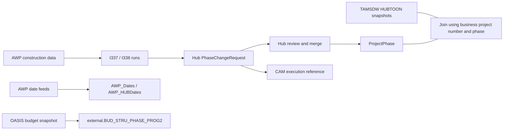

# AASHTOWare ↔ TheHub ↔ OASIS/TAMSDW investigation

Investigated **2026-09-06** using read-only SQL against the `Data-Warehouse` database configured in `backend/.env`, plus actual `OPENQUERY([TAMSDW], ...)` calls. The local SSH tunnel was initially down; the documented tunnel was restored before querying. No database data, jobs, or application code were changed.

This report treats “hollowed bus interface” as the **Hub/OASIS financial bus** from the supplied documents. The exact phrase did not identify a separate interface in the inspected metadata. The related TAMSDW/dTIMS path is covered too.

**Evidence:** [query results and exact SQL](research/hub-awp-bus-2026-09-06/evidence.json), [validated project trace query](research/hub-awp-bus-2026-09-06/project-interface-trace.sql), and [AWP column dictionary](research/hub-awp-bus-2026-09-06/awp-columns.csv). “Verified” below means directly observed in this session; interpretation is identified separately.

## 1. What actually connects the systems

The strongest verified connection is a **construction change-request workflow**:



The SQL proves that AWP-origin change requests can later reference a CAM run. It does **not** expose CAM XML, the downstream OASIS acknowledgment for a particular document, or the ETL code that builds HUBTOON. The date tables and I337/I338 requests are separately observable; do not assume the I337/I338 jobs themselves load every date table.

### Correct process mapping

The supplied notes reversed I337 and I338. All observed run-name groups establish:

| ProcessId | Actual run name | Runs | Hub change requests referencing the run |
|---:|---|---:|---:|
| **7** | **SiteManagerI338** | 2,039 | 4,092 |
| **8** | **SiteManagerI337** | 1,880 | 1,132 |

All 5,224 referenced requests are CN-phase, non-closure requests. I338 request reasons explicitly name change orders, added work, overruns/underruns, and time extensions. I337 reasons identify AWP project/work-type adjustments. Its role appears to include initial contract amount/completion reconciliation, but the precise payload and calculation are not visible.

On September 3, I338 ran at approximately **12:05 and 16:05**, and I337 at **12:15 and 16:15**, in database timestamp time. These are observed run times, not retrieved scheduler definitions.

## 2. How the AASHTOWare fields work

### Identifiers: three different namespaces

| Identifier | Meaning and observed join |
|---|---|
| `Project.Id` | Hub integer surrogate key. `ProjectPhase.ProjectId` and `PhaseChangeRequest.ProjectId` refer to this. |
| `Project.ProjectId` | Hub business project number, stored as `varchar(10)`. This is the useful bridge to newer AWP identifiers. |
| `AWP_Dates.ProjectID` | Text interface identifier; join to `Project.ProjectId` where it matches. Legacy/revised identifiers also occur. |
| `AWP_HUBDates.ContractNumber` | Text contract identifier; matches the Hub business number for a subset. |
| `AWP_HUBDates.AWPContractID` | Integer identifier on the AWP side. It is **not** `Project.Id`. |
| `AWP_HUBDates.ProposalID` | Separate AWP proposal identifier. |
| `AWP_HUBDates.RevisionNumber` | AWP revision value; observed 0–5 and exceptional 32/38/45/50/99. Do not assume a simple sequential history. |
| `AWP_ChangeOrders.ContractID` | Text identifier matching Hub business project numbers for a subset; unlike the integer `AWPContractID`. |
| `StateProjectNumber`, `FederalProjectNumber` | Other project identifiers carried by AWP. Keep them separately; they are not surrogate keys. |

There are **15,184 Hub projects**, with 15,184 distinct business numbers. Direct equality joins yielded:

| AWP table | Rows | Rows matching a Hub business number |
|---|---:|---:|
| `AWP_Dates` | 9,554 | 2,367 |
| `AWP_HUBDates` | 5,490 | 1,831 |
| `AWP_ChangeOrders` | 2,713 | 2,335 |

Nonmatches include identifiers such as `0000404R1`, padded legacy values, and placeholders. A nonmatch is not by itself a failed interface. Do not cast all AWP identifiers to integers or strip revision suffixes indiscriminately.

### Date tables and field meanings

`AWP_Dates` is a five-column feed: `ProjectID`, `Publication_dt`, `FEA_Dt`, `EXEC_Dt`, `UpdatedDate`. Its 9,554 identifiers are currently distinct. `AWP_HUBDates` is richer: 19 columns including identifiers, `Description`, `EandCPercent`, nine business dates, and `LastUpdated`. Its 5,490 contract numbers and proposal IDs are currently distinct; 1,537 distinct AWP contract IDs are populated. Observed uniqueness is not a promise of future cardinality.

| Field | Business meaning | Important distinction |
|---|---|---|
| `Publication_dt` / `PublicationDate` | Publication/advertisement date | Separate from letting. |
| `LET_DT` | Letting date | Separate from award and execution. |
| `AWARD_DT` | Awarded date | Contract award event. |
| `EXEC_DT` | Execution date | Separate from fully executed agreement. |
| `FEA_DT` | **Fully Executed Agreement Date** | The earlier “final/FHWA approval” interpretation should be corrected. |
| `NTP_DT` | Notice to Proceed date | Permission to start, not necessarily the work-start date. |
| `WKBG_DT` | Work Begin date | Strongly corresponds to `ProjectPhase.ConstructionStartDate`. |
| `SWKC_DT` | Substantial Work Completion date | Does not by itself establish financial closeout. |
| `FEPA_DT` | **Final Estimate Package Approval Date** | A late construction/closeout milestone. |
| `UpdatedDate` / `LastUpdated` | Feed update timestamp | Does not establish completeness of each business-date field. |
| `EandCPercent` | Decimal percentage carried by AWP | Expansion, calculation basis, and effect on Hub amounts remain unverified. |

The FEA/FEPA and other contract date labels are supported by WVDOT's indexed [Life of a Contract presentation](https://transportation.wv.gov/highways/mcst/Documents/2024%20MatCon/Presentations/Life%20of%20a%20Contract.pdf). Direct retrieval of that older PDF returned 404 during this session; its indexed table remained available. WVDOT's [2026 construction presentation](https://transportation.wv.gov/highways/mcst/Documents/2026%20Matcon/9%20Ballard%2C%20Kees%20CRL%20%26%20Const%20Presentation%20for%20Const%20Conf.pptx.pdf) independently identifies WKBG and SWKC.

### Important completeness problem

The two feeds disagree on **coverage**, even though both have recent update stamps:

| Observation | `AWP_Dates` | `AWP_HUBDates` |
|---|---|---|
| Latest feed update | 2026-09-04 02:43 | 2026-09-06 01:02 |
| Populated execution dates | 1,541 | 607 |
| Latest execution date | **2026-09-03** | **2024-04-30** |

Across 5,233 matching identifiers, **888 rows have an execution date only in `AWP_Dates`**. There were no conflicting non-null execution dates in that comparison. The richer table still receives recent FEPA values, through September 4, 2026, so it is not uniformly frozen. Its publication dates include a 2037 value; future/placeholder dates need validation before being treated as completed events.

Example: Hub project `2026140001` has AWP contract ID **1595**, proposal ID **10334**, and a null rich-feed execution date. `AWP_Dates` supplies execution **2026-08-25** and fully executed agreement **2026-09-02**. An I337 request was created on September 3.

For an analytical display, prefer `AWP_Dates` for publication/execution/FEA coverage while retaining each source's raw value and update timestamp. Use the richer feed for its additional fields. This is a reporting recommendation, not a verified Hub application precedence rule.

### Relationship to Hub dates and milestones

Hub has separate phase planning dates, construction-start dates, and `PhaseMilestone` planned/expected/actual dates. They are not interchangeable:

- `ProjectPhase.ConstructionStartDate` equals AWP `WKBG_DT` in **507 of 508** CN rows where both are populated. This is strong evidence of the intended correspondence; the writer code is inaccessible.
- Hub `ADV. CONTRACT` actual dates match rich-feed publication dates in 992 rows; `LET CONTRACT` matches letting in 571; `AWARD CONTRACT` matches award in 572; `COMPLETE CONST.` matches substantial completion in 304.
- Those counts are matches, not complete coverage rates. The richer feed is missing many newer dates. `START CONSTRUCTION` milestone actuals match WKBG in only 19 rows, so do not substitute that milestone for `ConstructionStartDate` without further validation.
- In the broader 2,361-row CN comparison, only two phase-start dates equal the simple-feed execution date. `PhaseStartDate` is not generally contract execution.

## 3. Change orders: import is distinct from approval

`AWP_ChangeOrders` carries contract/vendor/address identifiers, change-order number/type/reason/description, participating and nonparticipating amounts, adjustment days, adjusted completion date, and import status. The physical completion column is misspelled **`AdjustedCompletonDate`**.

All 2,713 current rows have `UpdatedInHUB = 1`; `(ContractID, ChangeOrderNumber)` is currently unique. This flag **does not mean the resulting request is merged or financially approved**.

Verified example, project **2021000717**, CN0001:

1. AWP row **2707**, CO **001**, records a participating adjustment of **−$534,140.87**, adjusted completion **2026-08-28**, and `UpdatedInHUB=1`; `LastUpdated` is September 3 at 15:10.
2. I338 run **59826**, September 3 at 16:05, created Hub CR **76924** with the same amount and date, `InterfaceStagingId=5534`, and a reason explicitly naming CO 001.
3. The CR is **not merged** and has no CAM run reference. The live phase still has participating amount **$3,966,666.66** and end date **2026-12-31**.
4. Actual `OPENQUERY` joining to TAMSDW CN financial rows returns budget **$3,966,666.66**, expended **$2,906,243.98**, and balance **$1,060,422.68**.

Thus the imported change-order amount is an adjustment in this example, not the entire authorized phase budget. Preserve sign, review state, and source request identity. Later Hub edits can change imported request values.

A second example proves the CAM connection: project **2024350045**, CN0001, CR **76840** was created by I338 run **59770**, merged September 3 at 09:23, and references CAM run **59801** at 09:32. The CR and live phase contain **$9,044.29 nonparticipating**. The AWP source also had a −$105,000 participating adjustment, but that CR field is now null: this is evidence that the request after review need not remain an exact copy of the imported row. In total, **610 I338-origin and 210 I337-origin CRs** currently reference a CAM run.

Current I338 requests: 2,991 merged, 1,077 canceled, 24 neither. I337: 1,054 merged, 62 canceled, 16 neither. These are request counts, not unique projects or a measure of interface failure.

## 4. The Hub/OASIS financial bus

The documents describe a batch financial exchange; live logs confirm the named processes and their timing. Payload direction and document contents cannot all be independently established with this login.

| ProcessId | Process | Verified activity / interpretation |
|---:|---|---|
| 22 | `I385_0803_FN_HUB_*.xml` | 2,729 XML-named completed runs; latest September 3. Inbound finance role comes from the supplied documentation. |
| 22 | `Generate BGPHR` | 12 older runs under the same process ID; distinguish by name. Latest is September 18, 2025. Do not count these as XML files. |
| 5 / 6 | `CAS` / `CAS_Response` | Financial action/response pair described by the notes; current batch runs observed. Exact CAS payload remains unknown. |
| 9 / 10 | `CAM` / `CAM_Response` | CAM has direct last-run references on 3,068 projects, 3,412 phases, and 6,648 CRs. |
| 23 | `BGPHR_Response` | Current response runs; closure-related status footprint on requests. |
| 17 | `ExternalTablesLoad` | Last logged June 23, 2026. |
| **28** | **`Execute Process: I416_ExternalTablesLoad`** | **60 runs beginning June 24, 2026**, latest September 3. Timing suggests a load-process replacement, not proof of identical inputs. |
| **30** | **`OASIS Data Warehouse replication`** | **25 runs beginning August 5, 2026**, latest September 4 at 04:00. New relative to supplied notes. |

On September 3 the I385 → CAS → CAM sequence appeared at **06:30, 09:30, and 14:30**. Responses appeared in bursts around **08:20–08:50, 11:33–11:50, and 16:20–16:50**. The observed bus is not an all-day, every-ten-minute poll loop.

The last-30-day query found `(RunStatus, ReturnCode)=(3,4)` on all observed CAS/CAM/response and SiteManager runs, and `(3,1)` on all 58 I385 XML runs. These are their usual observed code pairs, not proof that each business request was accepted. Process 30 uses different pairs: `(1,1)` and `(2,5)`, sometimes with a populated end time. Its enum semantics need the process implementation; the older universal “status 1 = aborted” health rule cannot safely be applied to it.

### BGPHR: the exact status dictionary remains unknown

Verified on `PhaseChangeRequest`:

| BGPHRStatusId | Requests | Observed pattern |
|---:|---:|---|
| 0 | 428 closures, plus non-closure requests | Includes 136 closure requests whose current phase is Closed. Zero is not sufficient to identify an open backlog. |
| 1 | 6,033 | All closures; 5,962 have FMIS N/A, 70 Approved, one no matching FMIS label. |
| **3** | **1** | Closure CR 70533, project 2020000888/CN0001; phase Open, not merged; modified September 3. |
| 4 | 2,408 | All closures; 1,621 FMIS Approved, **709 N/A, 70 Rejected**, eight no matching label. |
| 5 | 6 | All closures. Exact meaning not verified. |

All positive BGPHR values occur on closures, which supports a closeout role. It does not establish that 1 means non-federal success, 4 means federal approval, 5 means cancellation, or that changing the status causes a zero balance. No BGPHR lookup table was visible.

For current reporting, first define which closure request is relevant. A useful explicit selection rule is highest `ChangeRequestNo`, then `Created` and `Id`, optionally excluding canceled requests; this still needs to match the intended workflow question. **Do not use `MAX(BGPHRStatusId)` as “latest status.”** Numeric status order is not chronology.

`external.BUD_STRU_PHASE_PROG2` currently has **54,095 rows**, carrying budgets, actual expenditures, encumbrances, effective dates, and funding-line identifiers. Every row currently has null `ImportedDate`, `SourceFileName`, and `ExecutionInstanceId`. Those columns exist, but cannot presently prove which load populated the budget data.

## 5. What OPENQUERY established

`TAMSDW` is the configured linked server with data access enabled. I queried remote catalogs, HUBTOON data and aggregates, and executed a real join back to Hub project/phase rows.

### Financial tables have funding detail and overlap

| Remote table in `DOTDataWarehouse.dbo` | Rows | Distinct project/phase keys | Keys with multiple rows | Raw budget sum | Raw balance sum |
|---|---:|---:|---:|---:|---:|
| `HUBTOONBASEROW` | 13,410 | 12,678 | 596 | $8,582,457,367.32 | $1,912,544,182.89 |
| `HUBTOONBASEROWCNDATA` | 13,401 | 12,503 | 723 | $12,486,960,901.47 | $2,654,310,412.53 |

There are up to five rows per project/phase key. Sample repeated keys differ by appropriation, with distinct dollar values. There are **11,084 shared project/phase keys between the two tables**. These are raw table totals, not a certified combined financial balance.

Consequences:

- Preserve fund/appropriation/authorization detail, or deliberately aggregate one selected table to project/phase before joining to Hub requests.
- A repeated project/phase key is not necessarily a duplicate financial line; do not discard it with an arbitrary `DISTINCT` or `TOP 1`.
- Do not add ROW and CN table totals or the earlier documents' two backlog estimates without proving which monetary components are disjoint.
- Both tables now have **26 columns**, including `Unit` and `Unit_Name`; the supplied 24-column description is outdated.
- The precise source-view-to-table ETL and refresh cadence remain unverified.

The bridge is:

```text
PhaseChangeRequest.ProjectId → Project.Id
Project.ProjectId → HUBTOON.ProjectID (numeric representation)
ProjectPhase.PhaseCode → HUBTOON.PhaseCode
```

The validated SQL artifact uses `TRY_CONVERT(bigint, p.ProjectId)` for the remote numeric identifier and aggregates CN financial rows before attaching them to phase records. It retains AWP identifiers, both feed timestamps, the latest AWP request under an explicit ordering, and its original and last interface runs. Its two worked projects returned successfully.

### dTIMS has a named integration table, but it is empty

`OPENQUERY` exposes **`OM_WVDOT.operations.HubIntegration`** with `Id`, `HubId`, `MajorProgramId/Name`, `ProgramId/Name`, and `PhaseId/Name`. It contains **zero rows**. It is a schema provision for a Hub integration, not evidence of an operating populated feed in this database.

`OM_WVDOT.operations.Contract` also exists, but a similarly named contract key is not enough to establish an AWP relationship. No AWP-named object appeared in the inspected production OM/asset catalogs. Accessible UAT/pilot databases were discovered but were not treated as production evidence.

## 6. What remains inaccessible or unproven

- `OasisFinance`: database access denied to this login.
- `msdb.dbo.sysjobs`: SELECT explicitly denied.
- Hub module definitions: 35 visible module entries, **zero readable definitions**; `VIEW DEFINITION=0`. An empty definition search does not establish absence of interface code.
- No AWP extended-property descriptions were returned.
- No payloads were retrieved, so I337 calculation rules, exact CAM/CAS document mappings, BGPHR enum labels/transitions, the rich-date feed gap, and HUBTOON ETL remain unresolved.

The next evidence needed is the interface application mapping/configuration or job definitions and a redacted payload from each relevant interface. The database investigation already establishes the identifier bridge, the I338-to-CR mapping, actual review-state differences, CAM audit linkage, date-coverage limits, and the remote reporting grain.

## 7. Corrections to the supplied notes

1. I338 is process **7**; I337 is **8**.
2. CAM does leave a readable footprint through `LastExecutionInstanceId`, including AWP-origin requests.
3. FEA is **Fully Executed Agreement**; FEPA is **Final Estimate Package Approval**.
4. A recently refreshed AWP table does not guarantee current values in every date field.
5. BGPHR labels and causal “zeros the balance” claims were too strong; current data contains counterexamples and status 3.
6. The response bus operates in observed bursts, not continuously every ten minutes.
7. I416 and OASIS warehouse replication are newer processes absent from the June notes.
8. OASIS budget provenance columns are currently empty.
9. HUBTOON contains multiple funding rows per project/phase, overlaps across ROW/CN bases, and now has 26 columns. The earlier combined backlog total is not established by simply adding both bases.

Original references: `Downloads/hub_stuff/HUB_OASIS_HUBTOON_FINANCIAL.md`, `Downloads/I385_BGPHR_OASIS_Bus.md`, and `Downloads/HUB_System_and_Interfaces.md`. The original files were preserved.
